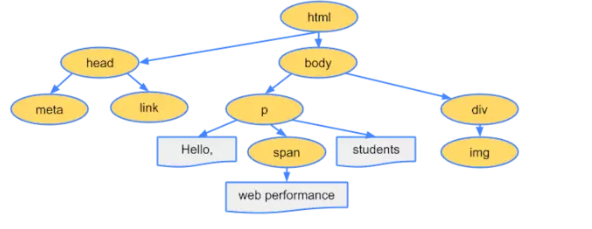
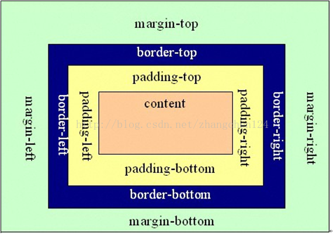

# HTML & CSS 概述
HTML - Hyper Text Markup Language 超文本标记语言；定义网页有什么。

CSS - Cascading Style Sheets 层叠样式表; 定义网页中的东西长什么样。
# 一些简单的术语
1.web - 互联网

2.W3C - 万维网联盟，非盈利组织 官网 w3c.org 

为互联网提供各种标准。

3.XML - 可扩展的标记语言：extension markup language,用于定义文档结构

在md文档中 ...xml 表示识别为xml代码

```<!DOCTYPE html> h5文档声明 不属于标签```

...xml
<人物>
   <姓名>李明</姓名>
   <年龄>20</年龄>
</人物>
...

# 查询文档网站
MDN：Mozilla Development Network,Mozilla开发者社区

https://developer.mozilla.org/zh-CN - 中文网址

国内最权威的web前端查询网站

# HTML
HTML是由w3c定义的语言标准：用于描述页面结构的语言

主要就是各种各样的标签 HTML属于标记语言
## HTML实体
实体字符 HTML Entity

实体字符通常用于在页面中显示一些特殊符号，如元素<、>、空格等。

通常有两种表示方式：
1.&单词(常用) - &lt\; 小于 、&gt\;大于、&nbsp\;空格、&copy版权符号、&amp& 符号 都要在后面接分号;

2.&#数字

# CSS 
CSS也是w3c定义的语言标准：css是用于描述页面展示的语言

css决定了页面长什么样子

CSS必须要套在元素上

# HTML & CSS 执行
由浏览器内核来执行 生成页面 

浏览器 ：

1.shell —— 外壳
2.core —— 内核(JS执行引擎,渲染引擎)

市面上主流的浏览器(有自己的独立内核)
IE      trident
FirFox  Gecko
Chrome  Webkit / Blink
Safari  Webkit
Opera   Presto / Blink

# 版本和兼容性
HTML5 、 CSS3 

HTML5 - 2014年   CSS3 - 目前还没有制定完成

XHTML：可以认为是HTML的一种版本 严格语法 完全符合XML的规范 现在不需要了

在md中添加图片的代码快捷生成键 CTRL+alt+v

index - 一般用于命名主界面

# 注释
注释为代码的阅读者提供帮助，注释不参与运行

html 注释格式为 \<!-- 注释内容 -->

# HTML基础

## 元素
其他叫法：标签、标记 官方称为 Element(元素)

元素 = 起始标记(begin tag) + 结束标记(end tag) + 元素内容 + 元素属性 

元素内容 - 一般用于页面要显示的内容

属性 = 属性名 + 属性值

### 属性的分类 ：

1.局部属性 - 某个元素特有的属性

2.全局属性 - 所有元素通用

空元素：没有结束标记的元素  也被称为单标签元素

在 HTML 中有以下这些空元素：
```JS
<area>
<base>
<br>
<col>
<colgroup> when the span is present
<command>
<embed>
<hr>

<input>
<keygen>
<link>
<meta>
<param>
<source>
<track>
<wbr>
```

### 元素的嵌套
元素不能相互嵌套

\<div>
\<p>
\</div>
\</p>


以上写法是错误的

### 元素之间的关系

父元素、子元素、祖先元素、兄弟元素、后代元素

## 语义化

### 什么是语义化

1.每个HTML元素都有具体的含义 
比如：
a元素表示超链接 
p元素表示段落 
h1元素表示一级标题

2.所有元素与展示效果无关，元素展示在页面中的效果由css来决定

因为浏览器带有默认的css样式，所以每个元素有一些默认的样式

总结：什么是标签语义化？ -  让合适的标签去做合适的事

**重要：选择什么元素，取决于内容的含义，而不是显示出的效果**

### 为什么需要语义化

1.为了搜索引擎优化(SEO) 

搜索引擎:百度、搜搜、Bing、Google等

便于搜索引擎理解我们编写的网页

2.为了让浏览器理解网页

<div>、<sapn>只表示容器 没有语义化

## 元素只需要记住最常用核心的元素即可

以前：元素有的会独占一行(块级元素)、而有些元素不会(行级元素)

H5：已经不再使用这种标准了，使用一种更复杂的分类

w3c规定 元素表示什么含义与显示效果无关

# HTML & CSS 基础部分

## 常用元素
HTML5中支持的元素：HTML5元素周期表 百度直接搜索

### H5中采用按照内容分类的方式分类:

1. 主内容类：描述了很多元素共享的内容规范

2. 表单相关的内容类：描述了表单相关元素共有的内容规范

3. 特殊内容类：描述了仅仅在某些特殊元素上才需要遵守的内容规范，通常这些元素都有特殊的上下文关系

### h
h元素 - 标题元素 head 有h1 - h6 6种

### p
p元素 - 段落元素 paragraphs

### sapn [无语义]
只是用于作为一个容器的作用，仅用于设置样式

### pre 
预格式化文本元素

空白折叠：在源代码中连续空白字符(空白、换行、制表)，在页面显示时会折叠为一个空格

例外：在pre元素中的内容不会出现空白折叠

在pre元素内部出现的内容，会按照源代码格式显示在页面上

该元素通常用于在网页中显示一些代码

pre元素功能的本质是其具有的默认css属性
white-sapce: pre;

显示代码时，通常在外面套上一个code元素，表示这是一段代码

### a元素 - 超链接

#### href属性  
href属性 - hyper reference(引用):通常表示要跳转地址

功能：

1.跳转到某个网页地址(普通链接)

2.跳转到某个锚点(在同一个网页中跳转)(锚链接)
id属性：全局属性，表示元素在文档中的唯一编号

3.功能链接
点击后，触发某个功能 在href属性后面写上

-执行js代码,javascript:

-发送邮件,mailto:要发送给的邮箱地址

打开用于自己计算机上的邮件软件发送

要求用户的计算机上安装有邮件发送软件：exchange

-拨号 tel:电话号码

多用于手机端，pc端需要用户安装拨号软件

3.阻止页面跳转 - 在href后面接上javascript:; 就可以阻止a标签的跳转功能

把a标签作为一个按钮时，我们会这样做

#### target属性

表示跳转窗口位置。

target的取值：

-_self:在当前页面窗口打开，默认值

-_blank:在新的窗口中打开

## 引入资源路径的写法

### 站内资源和站外资源

站内资源：当前页面中的资源

站外资源：非当前页面中的资源

### 绝对路径和相对路径

对于站内资源：绝对路径

对于站外资源：相对路径(多使用)/绝对路径

1.绝对路径的书写格式：

url地址:

...

协议名://主机名:端口号/路径

schema://host:port/path

...

例如：

https://mbd.baidu.com/newspage/data/landingsuper

协议名: http、https、file

主机名：域名、IP地址

端口号：如果协议是http协议，默认端口号80；如果协议是https协议，默认端口443，端口号可以省略

http://www.renren.com:80/

https://www.baidu.com:443/

**当跳转目标和当前页面的协议相同时，可以省略协议**

2.相对路径

以./开头，./表示当前资源所在的目录

可以书写../表示返回上一级目录

相对路径中./可以省略

## 图片元素

### img元素

image缩写，空元素

**src属性：source-资源**

alt属性：当图片失效加载不出来时，将使用该属性的文字替代图片

### 和a元素联用

### 和map元素

map元素 : 地图

map的子元素：area - 区域

area的属性有 shape(形状)="" coords(坐标)="" href(链接地址)="" alt="" target=""

衡量坐标时，为了避免误差，需要使用专业的衡量工具：ps、pxcook

### 和figure元素

指代、定义，通常用于把图片、图片标题、描述包裹起来

当需要标题(h元素)、文字(p元素)、图片相关联的时候，就可以把它们放在figure元素里。这样浏览器就知道它们相互关联。

子元素：figcaption 把标题元素放在里面，表示这是标题

## 多媒体元素(H5新元素)

video 视频

默认在页面中是不会显示页面的，需要鼠标在页面视频处点击右键，显示控制按钮

如果想要一开始就显示控制按钮的话，使用 controls属性

controls : 控制控件的显示，取值只能为controls

autoplay : 布尔属性，表示进入页面自动播放 —— 在有些浏览器的设置模式下，是不能自动播放的，添加autoplay属性也没用，可以使用muted

muted : 布尔属性，表示静音播放

loop : 布尔属性，表示循环播放


audio 音频 和视频使用方法一致


某些属性只有两种状态 1.不写  2.取值为属性名，这种属性叫做布尔属性

布尔属性，在HTML5中可以不用写属性值

**多媒体元素的资源也可以使用绝对路径/相对路径的写法**

### 兼容性

1.旧版本的浏览器不支持这两个元素

2.不同的浏览器支持的音频/视频格式可能不一致

音频 - MP3  视频 - mp4/webm

为了保证兼容性，一般写两个播放，一个播放MP4格式、一个播放webm格式

## 列表元素

### 有序列表

ol: ordered list - 有序列表 父元素

li：list item - 列表项 子元素

#### ol中的属性值 
type="" 表示列表中的项以什么来排序，如果填写数字1 - 就会按照1、2、3。。。排列(默认) 可以填写2、5...就会从2或5开始排列。type属性可填的值还有 i、I、a、A

**w3c新规表示有序列表中的序号除非非常重要，不然请使用css的list-style-type属性来替代**

reversed 布尔属性 表示逆序排列 与显示无关 逻辑上是倒序


### 无序列表(使用最多)

ul：unordered item - 无序列表

无序列表常用于制作 菜单/新闻列表

### 定义列表

通常用于一些术语的定义

dl：definition list - 表示定义列表的意思(父元素)

(子元素)

dt：definition title - 表示定义的标题

dd：definition description - 表示术语的描述

## 容器元素

容器元素：该元素代表一块区域，内部用于放置放其它元素

### div元素 span元素

没有语义化 没有什么显示效果

### 语义化容器元素(h5)

header: 通常用于表示页头，也可以用于表示文章的头部

footer：通常用于表示页脚，也可以用于表示文章的尾部

article：通常用于表示整篇文章

section：通常用于表示文章的章节

aside：通常用于表示侧边栏（表示额外的信息、附加信息）

## 元素包含关系

以前：块级元素可以包含行级元素，行级元素不可以包含块级元素，a元素除外

现在：元素的包含关系由元素的内容类别决定

例如，查看h1元素中是否可以包含p元素 - MDN

总结：

1.容器元素中可以包含任何元素

2.a元素几乎可以包含任何元素

3.某些元素有固定的子元素（ul>li、ol>li、dl>dt + dd）

4.标题元素和段落元素不能相互嵌套，并且不能包含容器元素

# 为网页添加样式(css) 

占网页开发代码的四分之三

## 术语解释

...css
h1{
   color: chocolate;
   background-color: lightcoral;
   text-align: center;
}
...

上面的整个代码被称为一条css规则

css规则 = 选择器 + 声明块

### 选择器（后面有详细的说明）

选择器：用于选中元素 如 图上的h1

1.ID选择器 #+id名

2.元素选择器(标签选择器)

2.类选择器(使用最多) - 利用class属性 - .+class名

### 声明块

出现在大括号中

声明块中包含很多声明(属性)，每一个声明(属性)，表达了某一个样式规则

## CSS代码书写位置

1.内部样式表

书写在style元素中，一般在head元素中书写

2.内联样式表(元素样式表) - 权重最大 

直接写在元素style属性中，不用也不能写选择器

2.外部样式[推荐]

将样式书写到独立的css文件中，在html中用link元素链接

优点：

1.外部样式可以解决多页面样式重复的问题

2.有利于浏览器缓存，从而提高页面响应速度

3.有利于代码分离(HTML&CSS)，更容易阅读和维护

## 常见的样式声明

1.color
元素内部的文字颜色 
**预设值**：定义好的单词
**三原色，色值**：光学三原色（红、绿、蓝）-rgb()，每个颜色可以使用0-255之间的数值来表示，组合起来就叫做色值
**hex值**：#ff4400 这种写法
几种常见的颜色
淘宝红：#f40
马尔斯绿：#008c8c
黑色：#000
白色：#fff
紫色：#f0f
青色：#0ff
黄色：#ff0
灰色：#ccc

2.background-color
元素背景颜色

3.font-size
元素内部文字的尺寸大小
单位：
1）px：像素，绝对单位，简单理解为文字的高度占多少个像素  
2）em：相对单位，相对于父元素的字体大小
每个元素必须有字体大小，如果没有声明，则直接使用父元素的字体大小，如果内有父元素则使用基准字号-由浏览器规定-一般为14px

>user agent, UA,用户代理(浏览器)

4.font-weight
文字粗细程度，可以取值为数字，也可以取值为预设值(默认值：normal-相当于数字400）

一般就是用两个值不加粗normal、加粗的bold

5.font-family
字体类型
>strong元素默认样式加粗，strong表示重要的、不能忽略的内容

必须用户计算机有存在的字体才能有效

使用多个字体来匹配不同的环境

sanc-serif(非衬线字体) - 对于老式的计算机使用的字体

6.font-style
字体样式，通常用于设置斜体

>i元素、em元素，默认样式是倾斜字体；通常使用中，用它表示一个图标(icon)，em表示强调的内容

7.text-decoration
文本修饰，给文本加横线 可以取的值 
1.overline - 文本上加横线
2.underline - 文本下加横线
3.line-through - 文本中间加横线
4.none - 不加横线

>a元素
>del元素：表示错误的内容
>s元素：表示过期的内容

8.text-indent
首行文本缩进

9.line-height
每行文本的高度，该值越大，每行文本的距离就越大

设置行高为容器高度，可以让单行文本垂直居中

后面直接接数字表示行高是字体的多少倍不加em。

10.width
宽度

11.height
高度

12.letter-space
文字间隙

13.text-align

元素内部文字的水品排列方式 默认靠左排列

## 选择器

选择器：帮助你精准的选中想要的元素

### 简单的选择器
1.ID选择器
使用方法 #+id名

2.元素选择器
使用方法 直接写元素名

3.类选择器(class)
使用方法 .+class名

4.通配符选择器
使用方法 *{} 选中所有元素，通常用于初始化页面

5.属性选择器
根据属性名和属性值选中元素

6.伪类选择器
选中某些元素的某种状态

书写时顺序：

1) link：超链接未访问时的状态

2) visited：超链接访问后的状态

3) hover：鼠标悬停状态

4) active：激活状态，鼠标按下的时候

7.伪元素选择器

写法上在前面加两个冒号 可以生成子元素

before

after

### 选择器的组合

1.并且 
不加任何东西 p.a{} 选中 p元素并且class值为a

2.后代元素 —— 空格 
用空格隔开 div .a{} 选中div元素里面class为a (使用场合非常多)

3.子元素 —— > 
只能选中子元素 div>.a{} div子元素中class为a

4.相邻兄弟元素 —— + 
.a+li{} 表示选中class为a的元素下一个li元素

5.后面出现的所有兄弟元素 —— ~ 
.a~p{} 表示选中class为a后面兄弟元素中所有的p元素

### 选择器的并列

多个选择器，用逗号分隔
a，p{} 减少代码重复

## 层叠

理解概念：声明冲突 - 同一个样式，多次应用到同一个元素上

具体说就是在开发中，我们会设置一些集体样式，但某些元素也需要设置特殊样式，当集体样于特殊样式冲突时就叫声明冲突。有时我们会特意制造声明冲突

层叠：解决声明冲突的过程，浏览器自动处理(权重计算)

浏览器会经过三步来解决

### 1.比较重要性

重要性从高到第：

>作者样式：开发者书写的样式

1) 作者样式表中的!important (不建议使用)

2) 作者样式表中的普通样式表

3) 浏览器的默认样式

### 2.比较特性性

看选择器

总体规则：选择器选中的范围越窄，越特殊

具体规则：通过选择器，计算出一个四位数(xxxx)

1.千位：如果有内联样式记作1，反之为0

2.百位：等于选择器中所有id选择器中的数量 #id名

3.十位：等于选择器中所有类选择器、属性选择器、伪类选择器的数量

4.个位：等于选择器中所有元素选择器、伪元素选择器的数量

### 3.比较源次序

代码书写靠后的胜出

### 应用

1.重置样式表

书写一些作者样式，覆盖浏览器的默认样式

用重置样式表 -> 覆盖浏览器的默认样式

常见的重置样式表：normalize.css、reset.css、meyer.css 直接在百度搜索

百度搜索 meyer.css web

## 继承

子元素会继承父元素的某些CSS属性(不是所有属性-如宽、高都不会继承)

通常于文字内容相关的属性都能被继承 所以在开发中通常把字体属性都设置在body元素中

## 属性值的计算过程 

浏览器如何渲染页面 - 一个元素一个元素依次渲染，顺序是按照页面文档的树形目录结构构成



按照深度优先的方式去渲染树上的每一个元素

**渲染每个元素的前提条件是：该元素的所有CSS属性必须有值**

一个元素，从最开始所有的属性都没有值，到所有的属性都有值，这个计算过程，叫做属性值计算过程

属性值计算过程简介:

1. 确定声明值：参考样式表中没有冲突的声明，作为CSS属性

2. 层叠冲突：对样式表有冲突的声明使用层叠规则，确定CSS属性值

3. 使用继承：对任然没有值的属性，若可以继承，则继承父元素的值

4. 使用默认值：对任然没有值的属性，使用默认值(每个CSS属性都有默认值)

两个特殊的CSS属性值：
1. inherit：手动(强制)继承，将父元素的值取出来应用到该元素

2. initial：初始值，将该属性设置为默认值

## 盒模型

box：盒子，每个元素在页面中都会生成一个矩形区域（盒子）

盒子类型：

1. 行盒，display等于inline的元素
2. 块盒，display等于block、table...的元素

行盒在页面中不换行，块盒独占一行

display默认值为inline

浏览器默认样式表中设置的块盒：容器元素(div、head)、h1~h6、p

常见的行盒：span、a、img、video、audio h1~h5

### 盒子的组成部分

无论是行盒还是块盒，都由下面几个部分组成，从内到外分别为：

1. 内容    content
width、height 设置的是盒子内容的宽高
内容部分通常叫做整个盒子的**内容盒 content-box**

2. 填充    padding - (内边距)
盒子边框到盒子内容的距离可以设置四个值
padding-left、padding-right、padding-top、padding-bottom
无设置时默认为0
padding：简写属性  padding(上、右、下、左) - 顺时针
padding(上下、左右)
填充区+内容区 = **填充盒 padding-box**

3. 边框    border
边框 = 边框样式 + 边框宽度 + 边框颜色
边框样式：border-style
边框宽度：border-width
边框颜色：border-color
简写 border: 4px solid black;
边框+填充区+内容区=**边框盒 border-box**

4. 外边框  margin
边框到其他盒子的距离 有四个值
margin-left、margin-right、margin-top、margin-bottom
速写属性margin(上、右、下、左) - 顺时针



## 盒模型的应用(重要)

### 改变宽高范围

默认情况下，width 和 height 设置的内容盒宽高。

>页面重构师：将psd文件 (设计稿) 制作为静态页面

衡量设计稿尺寸的时候，往往使用的是边框盒，但设置width和height，则设置的是内容盒

解决方法：

1. 精确计算

2. CSS3: 利用box-sizing属性 box-sizing:border box; width、height就变成边框盒的宽高

### 改变背景覆盖范围

默认情况下，背景覆盖边框盒

但是可以通过background-clip属性进行修改

### 溢出处理

有时可能因为内容过多，会超过设置的宽高 - 默认超过的也可以看见

利用overflow,可设置溢出的部分隐藏(hidden)、生成滚动条(scroll)、自动(auto)

### 断词规则

word-break，会影响文字在什么位置被截断换行 可设置为：

normal：普通。CJK(中日韩) (文字位置截断)，非CJK字符 (单词位置截断)

break-all：截断所有。所有字符都会在文字位置截断

keep-all：保持所有。所有文字都在单词之间截断

### 空白处理

文字超过时，用点代替

只有一种方法记住就行  写三个属性:

white-space：nowrap - 设置不换行

overflow: hidden;

text-overflow: ellipsis;

**上面的方法我们只能用于单行文本，多行文本需要使用js**

## 行盒的盒模型

常见的行盒：包含具体内容的元素

span、strong、em、i、img、video、audio、a

## 行盒显著特点

1. 盒子沿着内容延申

2. 行盒不能设置宽高，由内容决定

调整行盒的宽高。应该使用字体大小、行高、字体类型来间接调整。

3. 内边距特点(填充区 padding)

水平方向有效，垂直方向仅会影响背景，不会实际占据空间

4. 边框(border)

水平方向有效，垂直方向不会实际占据空间

5. 外边距(margin)

水平方向有效，垂直方向不会实际占据空间

## 行块盒

display：inline-block 的盒子

1. 不独占一行
2. 盒模型中所有尺寸都有效

## 空白折叠 

空白折叠会发生在行盒(行块盒)内部或者行盒(行块盒)之间

## 可替换元素 和 非可替换元素

大部分元素，页面上显示的结果，取决于元素内容，称为**非可替换元素**

少部分元素，页面上显示的结果，取决于元素属性，称为**可以替换元素**

可替换元素：img、video、audio - 绝大部分可替换元素均为行盒。

可替换元素类似于行块盒，盒模型中所有属性都有效。 可直接理解为它们为行块盒

## 常规流

盒模型：规定单个盒子的规则

**视觉格式化模型(布局规则)：页面中的多个盒子排列规则**

视觉格式化模型，大体上将页面中盒子的排列分为三种方式：

1. 常规流
2. 浮动流
3. 定位

### 常规流布局

常规流、文档流、普通文档流、常规文档流

所有元素，默认情况下，都属于常规流布局

总体规则：块盒独占一行，行盒水平依次排列

包含块(containing block) : 每个盒子都有它的包含块，包含块决定了盒子的排列区域。

绝大部分情况下：盒子的包含块为其父元素的内容盒

#### 块盒规则

1. 每个块盒的总宽度，必须刚好等于包含块的宽度
宽度的默认值是auto 
margin的取值也可以为auto，默认值为0
宽度值、margin值为auto表示 - 将剩余空间吸收掉
当宽度与margin都为auto时，宽度全吸收，因为宽度的吸收能力强于margin
若宽度、边框、内边距、外边距计算后，任然有剩余空间，该剩余空间被margin-right全部吸收 - (指水平方向上)
**在常规流中，块盒在其中包含块中居中，可以定宽、设置左右margin为auto**

2. 每个块盒垂直方向上的auto值
height：auto，表示适应内容的高度 - 容器的高度会被内容撑开
margin-top/bottom：auto，表示0

3. 百分比取值
padding、宽、margin可以取值为百分比 - 相对于包含块的宽度
高度的百分比：
1)包含块的高度是否取决于子元素的高度(父元素没有设高度)，这中情况下无效为auto
2)包含块的高度不取决于子元素的高度，这种情况下百分比就相对于父元素的高度
理解：当父元素的高度与子元素无关时，子元素的padding、宽度、margin的百分比取的是父元素宽度的百分比

4. 上下外边距的合并
两个常规流块盒，上下外边距相邻，会进行合并 (上块盒的下margin 与 下块盒的上margin会合并 - 不是相加)
两个外边距取最大值  
**只要两个块盒相邻就会合并**

**解决方法**
有两种方法:

- 方法1
> 兄弟元素之间的距离直接设置其中一个元素的margin就行 而父子元素之间则使用padding来设置距离

- 方法2
> 在父元素使用伪元素选择器 代码为
```
.cleanheight:before{
   content = "";
   display = table;
}
```
table 为表格属性 也为块级元素
## 浮动

视觉格式化模型，大体上将页面中盒子的排列分为三种方式：

1. 常规流
2. 浮动
3. 定位

### 应用场景

1. 文字环绕
2. 横向排列

### 浮动的基本特点

修改float属性值为：

-left：左浮动，元素靠上靠左
-right：有浮动，元素考上靠右

默认值为none

1. 当一个元素浮动后，元素必定为块盒(display更改为block)
2. 浮动元素的包含块，和常规流一样为父元素的内容盒

### 盒子尺寸

1. 宽度为auto时，适应内容宽度
2. 高度为auto时，与常规流一致，适应内容的高度
3. margin为auto时，表示为0
4. 边框、内边距、百分比设置与常规流一样(除了高度外其他相对于包含块的宽度)

### 盒子排列

1. 左浮动的盒子靠上靠左排列
2. 右浮动的盒子靠上靠右排列
3. 浮动盒子在包含块中排列时，会避开常规流块盒子
4. 常规流块盒在排列时，会无视浮动盒子
5. 行盒在排列时会避开浮动盒子

>浏览器规则：如果文字没有在行盒中，浏览器会自动生成一个行盒包裹文字，该行盒叫做匿名行盒

当在做文字环绕效果的时候，若想要设置文字与图片的距离，应该在图片中使用margin属性

## 高度坍塌

**很重要的内容，在开发中也会很常见**

高度坍塌的原因：常规流盒子的自动高度，在计算时，不会考虑浮动盒子

解决方法：清除浮动 - 涉及CSS属性：clear

-默认值：none
-left：清除左浮动，该元素必须出现在前面所有左浮动盒子的下方
-right：清除右浮动，该元素必须出现在前面所有右浮动盒子的下方
-both：清除左右浮动，该元素必须出现在前面所有浮动盒子的下方

**清除高度塌陷的方法**
利用伪元素选器
```
.clearfix:after{
   content = "";
   display = block;
   clear = both;
}
```
还可以与父子元素外边距重叠问题合并写一个方法

```
.clearfix:after,
.clearfix:before{
   content = "";
   display = table;
   clear = both;
}
```

## 定位

视觉格式化模型，大体上将页面中盒子的排列分为三种方式：

1. 常规流
2. 浮动：float
3. 定位：position

定位：手动控制元素在包含块中的精准位置

涉及的CSS属性：position

### position属性

- 默认值：static - 静态定位(不定位)

- relative：相对定位

- absolute：绝对定位

- fixed：固定定位

一个元素，只要position的取值不是static，认为该元素是一个定位元素

定位元素会脱离文档流 (相对定位除外)

一个脱离了文档流的元素：

1. 文档流中的元素摆放时，会忽略脱离了文档流的元素
2. 文档流中元素计算自动高度时，会忽略脱离了文档流的元素 (高度坍塌类似)

### 相对定位

不会导致元素脱离文档流，只是让元素在原来位置上进行偏移

给一个元素加上position: relative属性，该元素就会变成定位元素，可偏移

可以通过四个CSS属性设置其位置：

- left
- right
- top
- bottom

相对定位下盒子的偏移不会对其他的盒子造成任何影响

默认规则，当左右偏移冲突时默认左边为准，上下冲突以上为准

通常用于给绝对定位的元素确定包含块

### 绝对定位

1. 高度为auto，适应内容
2. 包含块变化：不一定是父元素内容块，找祖先元素中第一个定位元素，该元素的填充盒为其包含块。若找不到，则它的包含块为整个网页 (初始化包含块)

### 固定定位

其他情况和绝对定位完全一样。

包含块不同：固定为视口 - (浏览器可视窗口)

### 定位下的居中

1. 定宽(高)
2. 将左右(上下)距离设置为0
3. 将左右(上下)margin设置为auto

绝对定位中和固定定位中，margin为auto时，会自动吸收剩余空间

>left:0;
>right:0;
>top:0;
>bottom:0;
>margin:auto;
页面居中写法

### 多个定位元素重叠时

堆叠上下文

设置z-index, 通常情况下，该值越大，越靠近用户

只有定位元素设置z-index有效

z-index可以是负数，如果是负数，遇到常规流元素、浮动元素，则会被其覆盖

### 补充

- 绝对定位、固定定位元素一定是块盒

- 绝对定位、固定定位元素一定不是浮动

- 没有外边距合并

## 更多的选择器

### 更多伪类选择器

1. first-child

选中第一个子元素 不加前缀会选中页面中全被第一个子元素

一般写为：元素:first-child 表示选中该元素中第一个子元素

li:first-child : 表示选中li中为一个的子元素的li，并且这个li必须是父元素的第一子元素，否则无效。

first-of-type：表示选中元素中第一个指定类型的元素。它则只要是第一个元素就行，不要一定为第一子元素，

2. last-child

与first-child类似，表示选中最后一个子元素

last-of-type也与上面的类似

3. nth-child

选中指定的第几个子元素

使用：a:nth-child(5) - 表示选择a元素排列为第五的a元素，要求必须为子元素，且排列顺序为第五。(需要看其他元素的)

() - 里可以填写的关键字
even: 关键字，等同于2n - 偶数

odd：关键字，等同于2n+1 - 奇数

4. nth-of-type (实际中使用最多的)

选中指定的子元素中第几个某类型的元素 只要求为第几个元素，不要求一定为子元素(不看其他元素，只看指定元素)

### 更多的伪元素选择器

1. frist-letter

选中文字中的第一个字母(中文为第一个汉字)

2. first-line

选中元素中第一行的文字

3. selection

选中元素中被用户框选的文字 p::selectiopn{}

## 更多的样式

### 透明度

有两种方式可以设置透明度

1. opacity，它设置的是整个元素的透明度，包括内容、边框、背景等
- 取值为0 ~ 1 (不常用因为会连带着自身的子元素一起透明)

2. 在颜色位置设置alpha通道(rgba) 最常用

**background-clip 可以设置背景颜色覆盖范围**

### 鼠标

cursor属性设置 默认值为auto   还可以设置为图片 图片格式都为.ico/.cur

设置图片  cursor:url("图片地址"),auto; 后面的auto表示当图片失效时使用auto

### 盒子隐藏

1. display: none; - 不生成盒子 会影响其他盒子的排列

2. visibility: hidden; 生成盒子，只是从视觉上移出盒子，盒子仍然占据空间

### 背景图

#### 和img元素的区别
img元素属于HTML的概念

背景图属于CSS的概念

1. 当图片属于网页内容时，必须使用img元素

2. 当图片仅用于美化页面时，必须使用背景图

### 涉及的css属性

1. background-image:url();

2. background-repeat: 当图片的大小小于设置区域时，就会重复出现直到铺满，就可以用它来控制重复 - 默认情况下，背景图会在横坐标和纵坐标中进行重复

3. background-size:  设置背景于的尺寸
预设值：contain - 把图片完全显示，但不改变比例、cover - 把图片铺满，但不改变比列，类似于object-fit
还可以设置数值或百分值： background-size: 100% 100%;

4. background-position(常用)
设置图片的位置 可设置x,y两个位置
预设值：left、bottom、right、top 
数值或百分比
两个都是相对于设置的盒子

雪碧图(精灵图) - spirit 利用background-position属性来做

5. background-attachment
通常用于控制背景图是否固定  
background-attachment: fixed; 背景图会相对于浏览器的可视窗口固定

6. 背景图于背景颜色混用
背景与背景颜色可以一起设定，那么背景图片不能覆盖的区域就会被背景颜色覆盖

**background是个复合属性可以写成一行，但是因为位置和尺寸都可以设置成百分比类型，所有浏览器规定必须先写位置再写属性。**
速写(简写)
background: url() no-repeat center/100% fixed #000;


# HTML & CSS 进阶部分

## iframe元素

iframe叫做框架页

通常用于在当前页面中嵌入另一个页面 

iframe 属于可替换元素

可替换元素的特点：
1. 通常为行盒
2. 通常显示的内容取决于元素的属性 例如img的显示就由src属性来决定显示的图片
3. css不能完全控制其中的样式 比如img元素显示的图片，我们不能改变图片的颜色
4. 具有行块盒的特点

iframe通常用于在自己的页面上放其他网页的视频

## 在页面中使用flash

利用两个元素把flash文件嵌入页面中（二选其一） ：

object 嵌入一个对象

embed  嵌入

它们都是可替换元素

### object元素

使用object元素时，data属性表示资源位置，type表示资源类型

资源类型 - 都才采用标准格式MIME(Multipurpose Internet Mail Extensions) - 多用途互联网邮件扩展类型

比如，资源是一个jpg图片，用MIME表示为 image/jpg

object元素中还可以添加子元素param表示 参数  可以通过它设置参数

### embed元素

属性用法与object一致，但是它是个空元素

由于浏览器的兼容问题 一般在开发中会用object元素把embed元素包裹起来

## 表单元素

它是一系列元素，主要用于收集用户数据 绝大部分都是可替换元素 与用户有交互的都为可替换元素

### input元素

主要是做输入框

- type属性：表示输入框类型（很多的取值） 常用的值
text：表示普通文本输入框
password：表示密码框
date：日期选择框，有兼容问题
search；搜索框，有兼容问题
range：滑块框 可以设置最小值和最大值 - 配合js - 兼容问题
color：颜色选择框
number：数字输入框 h5出来之前得浏览器会不支持 可以设置最小值与最大值 step属性决定上下下降得数字
checkbox：多选框  在使用中一组多选框会使用相同得name表示它们是一组的
radio：单选框 name一致才能单选
file：文件选择框

日期越颜色都是调用系统的功能，我们无法用css改变它们的样式

单选框和复选框的默认选择都可通过添加布尔属性 checked设置

input添加图片的方法:s

> <input type="image" src=""  \>


- value属性：输入框的值 (显示出来的值)

- placeholder属性：显示提示的文本，文本框没有内容时显示 (写提示的时候建议使用)

input元素还可以制作按钮 但是现在有新的元素专门制作按钮 当在老版本浏览器时可以使用

当type值为
- reset - 重置按钮

- button - 普通按钮

- submit - 提交按钮 

### select元素

下拉列表选择框

通常和option元素配合使用  布尔属性sectioned设置默认选中

下拉列表我们经常会把选项做一个分组 增加一个optgroup元素 label属性来设置分组名字

当下拉列表要设置多选的时候可以增加布尔值 multiple就行 按CTRL键可以多选

### textarea元素

文本域，多行文本框

属性：
- cols：表示有多少列，横向排列多少个文字
- rows：表示可以排多少行

显示文本写在内容区而不用写在value属性中 没有空白折叠

建议使用css来控制 width与height来控制

### 按钮元素

button元素 

type属性：
- reset: 重置
- submit：提交 （默认值）
- button：普通按钮 

### 表单状态

readonly属性：布尔属性，是否只读 ，不会改变表单显示样式

disabled属性：布尔属性，是否禁用，会改变表单显示样式

## 配合表单元素的其他元素

### label

普通元素，通常配合单选、多选框来使用
- 显示关联
可以通过for属性，让label元素关联某一个表单元素，for属性书写表单元素id的值 （显示效果为点击被label关联的文字也可以被选中）

- 隐式关联
用label元素把多选包含起来

### datalist

数据列表

该元素本身不会显示到页面，通常用于和普通文本框配合

### form元素

通常，会将整个表单元素，放置form元素内部 - 包裹表单元素的

作用是当提交表单时，会将form元素内部的表单内容以合适的方式提交到服务器。

form元素对开发静态页面没有什么意义

有两个属性

- action - 表示我们把数据提交到哪里

- method - 表示提交方式 有两种 get/post

### fieldset元素

表单分组 - 很少会使用

有子元素legend - 表示分组的标题

## 美化表单元素

### 新的伪类

1. focus

表示元素聚焦时的样式 按住键盘的tab键可以触发聚焦样式

因为不同的浏览器默认的聚焦样式会不同，为了保证网页在不同的浏览器上的显示样式，我们一般都会自己写聚焦样式，覆盖掉浏览器的默认样式

tabindex=""   表示按照tab聚焦的顺序 默认从上到下

2. checked

单选框或多选框被选中的样式

### 常见用法

在写单行文本框的时候，可以使用属性选择器来选中特定的文本框

1. 重置表单元素样式

2. 设置多行文本框textarea是否允许调整样式

默认可以调整  通过resize属性来控制

- both：两个方向上都可以调整(默认值)

- none：两个方向上都不可以调整

- horizontal：水平方向上可以调整

- vertical：垂直方向上可以调整

3. 文本框边缘到内容的距离

两个方法利用padding属性与text-indent属性

4. 控制单选框和多选框的样式

# CSS进阶

## @规则

at-rule: @规则、@语句、CSS语句、CSS指令

1. import
```
@import "路径"
```

导入另外一个CSS文件; 写在css文件中

2. charset

@charset "utf-8";

告诉浏览器该CSS文件,使用的字符编码集是utf-8 - 写在外部css文件中 必须写在第一行 当在CSS文件中有中文的时候建议写上,平时可以不用写

## web字体和图标

### web字体

解决用户电脑上没有安装相应字体  强制让用户下载该字体 - 用户感觉不到下载

使用@font-face指令制作一个新字体

### 字体图标

阿里巴巴的字体图标库：iconfont.cn  最好使用font class的方式 - 给项目增加字体图标后记得更新代码，css引用也会改变

### 块级格式化上下文 (重要知识)

全称 Block Formatting Context ， 简称BFC

它是一块独立的**渲染区域**，它规定了在该区域中，**常规流块盒**的布局

- 常规流块盒在水平方向上，必须撑满包含块 (表现为独占一行)

- 常规流块盒在包含块的垂直方向上依次排列

- 常规流块盒若外边距无缝相邻，则进行外边距合并

- 常规流块盒的自动高度和摆放位置，无视浮动元素/定位元素

BFC渲染区域

这个区域由某个HTML元素创建，以下元素会在其内部创建BFC区域

- 根元素 这意味着，&lt;html&gt;元素创建的BFC区域，覆盖了网页中的所有元素

- 浮动和绝对定位元素

- overflow不等于visible的块盒 (默认值为visible)

- display为inline-block、table-cells、flex

不同的BFC区域，它们进行渲染的时候互不干扰

创建了BFC的元素，隔绝了它内部和外部的联系，内部的渲染不会影响到外部

具体的规则：
1. 创建BFC的元素，它的自动高度需要计算浮动元素

2. 创建BFC的元素，它的边框盒不会与浮动元素重叠

3. 创建BFC的元素，不会和它的**子元素**进行外边框合并

一般创建BFC不会使用浮动和定位因为它们会改变页面盒子的排列，而是使用overflow: hidden; - 副作用最小

如果仅仅是为解决高度坍塌还是使用clenfix方法

如果子元素是浮动元素，父元素生成BFC，会自动计算浮动元素的高度，但是一但子元素是绝对定位/固定定位元素，而父元素的overflow，float，相对定位都没用，子元素会彻底脱离常规流

# 布局

## 多栏布局

两栏布局 

三栏布局

## 等高布局

一般是控制侧边栏

解决方式：

1. CSS3的弹性盒子

2. JS控制

3. 伪等高

## 元素顺序

在做三栏/两栏布局的时候，要先写浮动元素再写常规流元素

做主代码区域靠前书写的时 - 前提条件 - 左右边栏等宽

## 后台页面

看示例代码

## 行盒的垂直对齐

### 多个行盒垂直方向上的对齐

给没有对齐的元素设置vertical-align 表示垂直方向的排列方式

预设值

数值/百分比

### 图片的底部白边

图片的父元素是一个块盒，块盒高度自动，图片底部和父元素底边之间往往会出现空白

1. 设置父元素你的字体大小为0 - 副作用很大 会导致父元素中的文字看不进

2. 将图片设置为块盒 - 常用


## 样式补充

### display: list-item

设置为该属性的盒子，本质上仍然是一个块盒，但是同时该盒子会附带另一个盒子元素

本身生成的盒子叫做主盒子，附带的盒子称为次盒子，次盒子和主盒子依次排列

ul>li 默认就是list-item; li元素前面的点就是次盒子 

涉及到的css属性

1. list-style-type：可继承

设置次盒子中内容的类型

2. list-style-position: 

设置次盒子相对于主盒子的位置

3. 速写属性 list-style

前面两个属性的复写形式 - list-style：circle inside;

**清空次盒子**

list-style: none;

### 图片失效时的宽高问题

如果img元素的图片链接失效，img元素的特性和普通行盒一样，无法设置宽高

若要失效后img元素还要具有宽高的话，只要把img设置成行块盒/块盒就行

### 行盒中包含行块盒或者可替换元素

行盒的高度与它内部的行块盒或可替换元素的高度无关 (如果里面时块盒的话，行盒会被撑开)

行盒的高度与文字的高度有关

### text-align: justify

text-align: 

-left: 左对齐
-right: 右对齐
-center: 居中对齐
-justify: 除最后一行外，分散对齐(把空白平均分散)

### 制作一个三角形

把div的宽高都设为0，利用边框来做

### direction 和 writing-mode

开始 start -> 结束 end
左 left -> 右 end

开始和结束是相对的，不同的国家有不同的习惯

左右是绝对的

direction设置的是开始到结束的方向

writing-mode: 设置文字书写方向

### utf-8字符


# [知识扩展]

## 行高的取值

line-height

1. px，像素值

2. 无单位的数字 - 先继承在计算

3. em单位 2em - 表示当前字体大小的两倍 先计算再继承

4. 百分比 - 先计算再继承

设置多行文本的时候最好是直接写数字，不用加单位

## body的背景

**画布 canvas**

指一块区域与H5canvas元素无关

特点：

1. 最小宽度/高度分别为视口的宽度/高度 但是有可能比视口大

**HTML元素的背景**

覆盖画布

**body元素的背景**

如果HTML元素有背景，body元素正常 (背景覆盖边框盒)

若HTML元素没有背景，body元素的背景覆盖画布

背景图片与背景颜色类似

**关于画布背景图**

1. 背景图的宽度百分比，相对于视口而不是画布

2. 背景图的高度百分比，相对于网页高度(html高度)

3. 背景图的横向位置百分比、预设值、相对于视口

4. 背景图的纵向位置百分比、预设值、相对于网页高度

## 堆叠上下文

z-index: 

堆叠(层叠)上下文 (stack context),它是一块区域，这块区域由某个元素创建，它规定了该区域中的内容在y轴上排列的先后顺序

### 创建堆叠上下文的元素

1. HTML元素(根元素)

2. 设置了z-index(非auto)数值的定位元素

### 同一个堆叠上下文中元素在z轴上的排列

从后到前的排列顺序：（前指靠经用户）

1. 创建堆叠上下文的元素的背景和边框

2. 堆叠级别(z-index，stack leve) 为负值的块盒

3. 常规流非定位块盒

4. 非定位浮动盒子

5. 常规流非定位行盒

6. 任何z-index 是 auto 的定位子元素，以及 z-index 是 0 的堆叠上下文

7. 堆叠级别为正值的堆叠上下文

**每个堆叠上下文，独立于其他堆叠上下文，它们之间不能相互穿插**

