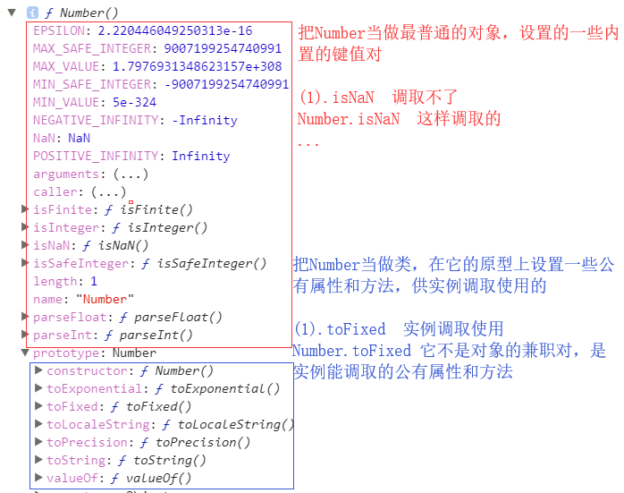
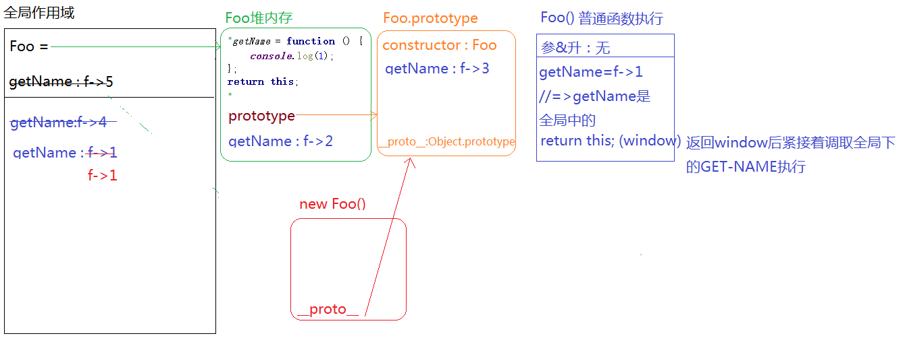
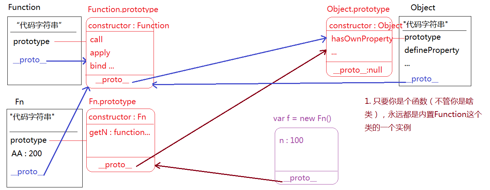
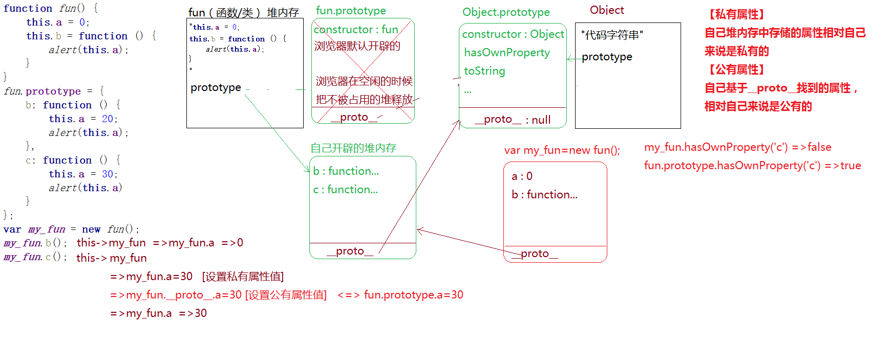
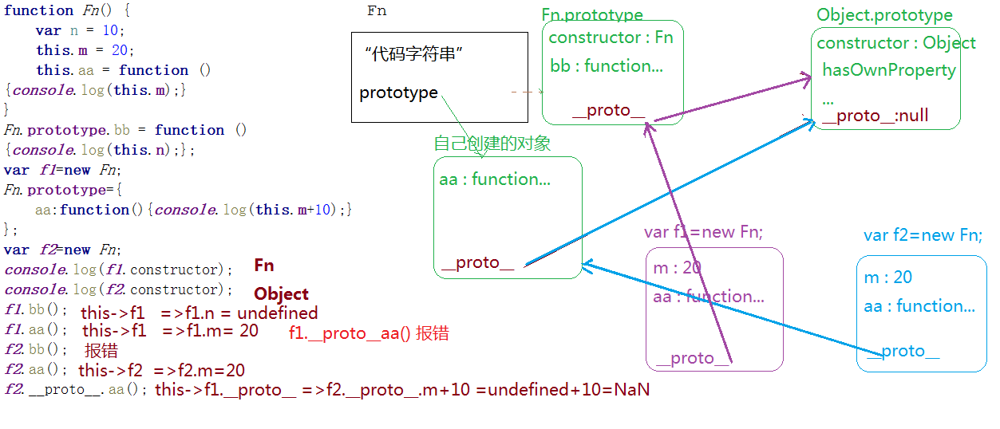

# 笔试计算部分
## 阿里超经典面试题（有难度）
前置条件
```js

/*  * 函数在JS中有三种角色
 *   1.普通函数
 *     ->堆栈内存释放
 *     ->作用域链
 *
 *   2.类
 *     ->prototype：原型
 *     ->__proto__：原型链
 *     ->实例
 *
 *   3.普通对象
 *     ->和普通的一个OBJ没啥区别,就是对键值对的增删改查
 *
 *   =>三种角色间没有什么必然关系 */


/*
function Fn() {
    var n = 10;
    this.m = 100;
}
Fn.prototype.aa = function () {
    console.log('aa');
};
Fn.bb = function () {
    console.log('bb');
};
*/

//=>普通函数
// Fn();//=>this:window  有一个私有变量n  和原型以及属性bb没有关系

//=>构造函数执行
// var f = new Fn;//=>this:f
// console.log(f.n);//=>undefined：n是私有变量和实例没有关系
// console.log(f.m);//=>100 实例的私有属性
// f.aa();//=>实例通过__proto__找到Fn.prototype上的方法
// console.log(f.bb);//=>undefined：bb是把Fn当做一个普通的对象设置的属性而已，和实例等没有半毛钱关系

//=>普通对象
// Fn.bb();

//============================================
```


```js
//=>JQ这个类库中提供了很多的方法,其中有一部分是写在原型上的,有一部分是把它当做普通对象来设置的
~function () {
    function jQuery() {
        //...
        return [JQ实例]
    }
    jQuery.prototype.animate=function(){}
    //...
    jQuery.ajax=function(){}
    //....
    window.jQuery = window.$ = jQuery;
}();
// $().ajax() //=>调不了
// $().anaimte() //=>这样可以调取
// $.ajax() //=>直接的对象键值对操作
// $.animate() //=>对象上没有animate这个属性，这个属性在和实例相关的原型上
```

```js
function Foo() {
    getName = function () {
        console.log(1);
    };
    return this;
}
Foo.getName = function () {
    console.log(2);
};
Foo.prototype.getName = function () {
    console.log(3);
};
var getName = function () {
    console.log(4);
};
function getName() {
    console.log(5);
}

Foo.getName();
getName();
Foo().getName();
getName();
new Foo.getName();  // 因为Foo后面有.xxx 所以它的运行机制与之前的完全不同 就是new (Foo.getName()整体) 运算符计算优先级
new Foo().getName();
new new Foo().getName();
```
详细解释上面的这到经典阿里前端js题



### 由上面的题引出的函数的三种角色的运行机制


## 腾讯面试题
```js
/*
 * 在实际项目基于面向对象开发的时候(构造原型设计模式),我们根据需要,很多时候会重定向类的原型(让类的原型指向自己开辟的堆内存)
 *  [存在的问题]
 *  1.自己开辟的堆内存中没有constructor属性,导致类的原型构造函数缺失（解决：自己手动在堆内存中增加constructor属性）
 *  2.当原型重定向后，浏览器默认开辟的那个原型堆内存会被释放掉，如果之前已经存储了一些方法或者属性，这些东西都会丢失（所以：内置类的原型不允许重定向到自己开辟的堆内存，因为内置类原型上自带很多属性方法，重定向后都没了，这样是不被允许的）
 */
/*
function Fn() {

}
// 当我们需要给类的原型批量设置属性和方法的时候,一般都是让原型重定向到自己创建的对象中
Fn.prototype = {
    constructor: Fn,
    aa: function () {

    }
};*/

/*
function fun() {
    this.a = 0;
    this.b = function () {
        alert(this.a);
    }
}

fun.prototype = {
    b: function () {
        this.a = 20;
        alert(this.a);
    },
    c: function () {
        this.a = 30;
        alert(this.a)
    }
};
var my_fun = new fun();
my_fun.b();
my_fun.c();*/
```


强化之前的原型链知识 引用值存的是地址
```js
function Fn() {
    var n = 10;
    this.m = 20;
    this.aa = function () {console.log(this.m);}
}
Fn.prototype.bb = function () {console.log(this.n);};
var f1=new Fn;
Fn.prototype={
    aa:function(){console.log(this.m+10);}
};
var f2=new Fn;
console.log(f1.constructor);
console.log(f2.constructor);
f1.bb();
f1.aa();
// f2.bb();
f2.aa();
f2.__proto__.aa();
```


# 写代码部分
## 如何实现数组去重？（乐视TV）
```js
let arr = [1, 2, 4, 3, 1, 2, 3, 4, 3, 2, 3, 4, 8];
// 去除数组中的重复项
// 方案一 ：创建一个新的数组 对要判断的数组进行循环 判断当前这一项在新数组中是否存在 不存在则添加到新数组中
/*  let newArr = [];
 for(let i = 0 ; i < arr.length; i++){
     let item = arr[i];
     if(newArr.includes(item)){
         continue;
     }
     newArr.push(item);
 } */
// 方案一的代码优化 - 利用forEach() 原理与之前的方法一致
/* let newArr = [];
arr.forEach(item => {
    if(newArr.includes(item)) return;
    newArr.push(item);
}); */
// console.log(newArr);
// 上面方法的缺点 - IE6~8都不支
// 方案二 不创建新的数组 在原数组上去重 
// 思想：循环从第一项开始，与第一项之后的每一项进行比较 相等则删除掉
/* for(var i = 0 ; i < arr.length ; i++){
    var item = arr[i];
    for(var j = i + 1 ; j < arr.length ; j++){
        var itemBacks = arr[j];
        if(item === itemBacks){
            // 相等删除
            arr.splice(j,1);
            // 数组塌陷：j后面的每一项索引都提前了一位，而下一次要比较的应该是j这个索引的内容
            j--;
        }
    }
}
console.log(arr); *
// 方案三 利用对象
// var obj = {};
/* for(var i = 0 ; i < arr.length ; i++){
    var item = arr[i];
    if(obj[item]){
        obj[item]++;
    }else{
        obj[item] = 1;
    }
}
var newArr = [];
// for in 变量对象的数字属性名时会按照升序顺序来编历
for(var prop in obj){
    newArr.push(Number(prop)); 
}
console.log(newArr); *
// 方案三的另一种写法 相对于上面的那些性能最优
/* for (var i = 0 ; i < arr.length; i++){
    let item = arr[i];
    // 判断在对象中是否存在
    if(obj[item] !== undefined ){
        arr.splice(i,1);
        // 解决数组塌陷
        i--;
        continue;
    }
    obj[item] = item;
}
console.log(arr); *
// 基于splice实现删除性能不好: 当前项被删除后，后面的每一项的索引都会向前提一位，如果后面的内容过多，一响性能
// 性能相对最优
/* for (var i = 0; i < arr.length; i++) {
    let item = arr[i];
    if (obj[item] !== undefined) {
        // 用最后一项与要删除的项互换 删除最后一项
        arr[item] = arr[arr.length - 1];
        arr.length--;
        i--;
        continue;
    }
    obj[item] = item;
}
console.log(arr); *
// 使用封裝的去重函数
// console.log(myfunction.unique(arr))
// 利用正则
// arr.sort((a , b) => {
//     return a- b;
// });
// let str = arr.join('@') + '@';
// let reg = /(\d+@)\1*/g;
// arr = [];
// str.replace(reg, (n,m) => {
//     m = Number(m.slice(0,m.length - 1));
//     arr.push(m);
// })
// 利用ES6 里的Set(对应的Map) 实现去重 Set方法自带去重效果
var ary = [...new Set(arr)];
console.log(ary);

// 基于原型链的方法来实现去重 - JS的高级运用方式
var ary = [12, 13, 23, 13, 12, 14, 12, 12, 14, 15];
//=>为啥ARY.SORT可以执行：因为SORT是ARRAY.PROTOTYPE上内置的属性方法,而ARY是它的一个实例,可以基于__PROTO__找到原型上的这个方法,然后调取使用
/*ary.sort(function (a, b) {
    return a - b;
});*/

/*
 * 基于内置类的原型扩展方法，供它的实例调取使用
 *   1.我们增加的方法最好设置“my”前缀(前缀是啥自己定)，防止把内置方法重写
 */
/*
Array.prototype.myUnique = function myUnique() {
    //=>方法中的THIS一般都是当前类的实例(也就是我们要操作的数组)
    //=>操作THIS相当于操作ARY，方法执行完成会改变原有数组
    var obj = {};
    for (var i = 0; i < this.length; i++) {
        var item = this[i];
        obj.hasOwnProperty(item) ? (this[i] = this[this.length - 1], this.length--, i--) : obj[item] = item;
    }
    obj = null;
};
ary.myUnique();//=>this:ary 此时方法执行完成的返回值是undefined(原有数组改变)
console.log(ary);
// ary.__proto__.myUnique();//=>this:ary.__proto__ (IE浏览器中屏蔽了我们对__proto__的操作)
// Array.prototype.myUnique();//=>this:Array.prototype 这种方式也很少用*/

//=>执行SORT返回排序后的数组(也是ARRAY的一个实例)，执行REVERSE返回的也是一个数组，执行POP返回的是删除的那一项(不是数组)
//=>JS中的链式写法：保证每一个方法执行返回的结果依然是当前类的实例，这样就可以继续调取方法使用了
/*ary.sort(function(a,b){
    return a-b;
}).reverse().pop();*/
// ary.sort(function(a,b){
//     return a-b;
// }).reverse().slice(2,7).join('+').split('+').toString().substr(2).toUpperCase();

// 以后面试需要写数组去重就写这个
Array.prototype.myUnique = function myUnique() {
    var obj = {};
    for (var i = 0; i < this.length; i++) {
        var item = this[i];
        obj.hasOwnProperty(item) ? (this[i] = this[this.length - 1], this.length--, i--) : obj[item] = item;
    }
    obj = null;
    return this;
};
var max = ary.myUnique().sort(function (a, b) {
    return a - b;
}).pop();

//=>思考题：阿里面试题
~function (pro) {
    pro.plus = function plus(val) {
        return this + Number(val);
    };
    pro.minus = function minus(val) {
        return this - Number(val);
    };
}(Number.prototype);
var n = 5;
var res = n.plus(3).minus(2);//=>res=6
console.log(res);
```

## document.parentNode 和 document.parentnode 的区别？（腾讯）

> document.parentNode 获取父级节点
> document.parentnode document上内有这个属性 - undefined

## 怎么规避多人开发函数重名的问题？（百度搜索）
> 基于单例模式来实现模块开发(最好) 或者基于闭包机制实现模块开发

> 单例模式 - 把实现当前模块开发的功能和属性都放在同一个命名空间下
```js
// 单例模式举例
var nameSpace = (function () {
    var n = 12;
    function fn() {
        //...
    }
    function sum() {
    }
    return {
        fn: fn,
        sum: sum
    }
})()
```

## JavaScript如何实现面向对象中的继承？ （百度移动）

## 你理解的闭包作用是什么，优缺点？（乐视）
> js中的一个重要机制，通过函数执行形成一个不销毁的私有作用域(对战内侧)，既保护了作用域里的变量和信息不被外界影响，又保存了一些信息。 - 在JS项目开发中闭包的最主要作用也就是保护 - 防止全局污染 和 保存信息 - 事件循环的时候。

# 面试方法 - 简单通俗的解释，不要说太多 ； 不会说可以直接手写

# 一个小面试题 - 给你一个数组要求你随机打乱它的顺序
```js
let arr = [12,34,56,7,89];

function fn(arr){
    arr.sort((a,b) => {
        return Math.floor(Math.random() * 10 - 5);
    });
    console.log(arr);
}

fn(arr);
```