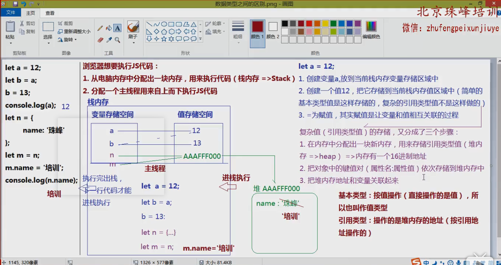

# 主流浏览器所使用的内核
## 常用的浏览器 2019年版
- webkit内核（V8引擎）
   + 谷歌（Chrome）
   + Safari
   + Opera >= V14
   + 大部分的国产浏览器
   + 绝大部分手机游览器
- Gecko
   + 火狐FireFox
- Presto
   + Opera => V14之前
- Trident
   + IE (10之前的版本)
   + IE edge开始使用了双内核（其中之一就是Chromium）
   + IE还有一款完全使用谷歌内核的浏览器 - BETA edge


## 国内浏览器使用的内核
- 1、360浏览器、猎豹浏览器内核：IE+Chrome双内核；
- 2、搜狗、遨游、QQ浏览器内核：Trident（兼容模式）+Webkit（高速模式）；
- 3、百度浏览器、世界之窗内核：IE内核；
- 4、2345浏览器内核：以前是IE内核，现在也是IE+Chrome双内核；

# 谷歌浏览器的控制台 （F12/Fn+F12）
 - Elements：查看结构样式，可以修改这些内容
 - Console：查看输出结果和报错信息，是js的调试利器
 - Sources：查看项目源码
 - Network：查看当前网站所有的资源的请求信息 （包括和服务器传输的HTTP报文信息）、加载时间等(根据加载时间进行项目优化)
 - Application：查看当前网站的数据存储和资源文件

# js的组成与发展

1. 目前的js已经不仅仅是客户端语言了，基于NODE可以做服务器端程序，所以js现在是全栈编程语言

2. js的组成
 - ECMAScript（ES3/5/6）：JS的核心语法 (变量、数据类型、操作语句等)
 - DOM: document object model 文档对象模型，提供各种API（属性和方法） 让JS可以获得或者操作页面中的HTML元素 (DOM和元素)
 - BOM: browser object model 浏览器对象模型，提供各种API让JS可以操作浏览器 ，描述了浏览器进行交互的方法和接口，并不会很常用，因为现在很多浏览器限制我们操作BOM

现在学习的js语法 主要是es3的语法

# JS的基本语法
> 按照相关的js语法，去操作页面中的元素，有时还要操作浏览器里面的一些功能


## js中的变量 variable

> 变量：可变的量 - 在编程语言中 变量就是一个名字，用来存储和代表不同值的东西 
> 准确的是，变量是在内存中为数据提供的一个内存空间的名字 通过这个名字可以找到这个内存空间获取其中存放的数据

js中创建变量的方法 6种方式 包括了ES6中的
```js
   // ES3
   var a; // 变量声明
   a = 13;  // 变量赋值

   // ES6
   let b;  // 变量声明
   b = 200;  // 变量赋值

   const c; // 常量声明 - 特殊变量
   c = 100;  // 常量声明的值不能被修改

   // 创建函数也相当于创建变量
   function fn () {}

   // 创建类也相当于创建变量
   class A{}

   // ES6的模块导入也可以创建变量 在Vue中的组件导入中经常使用
   import B from './B.js';

   // Symbol创建唯一值 (不常见)
   let n = symbol(100);
   let m = symbol(100);
   n == m // false


   // 使用最多的还是 var、let、const

```
## JS中的命名规范

严谨的命名规范：严格区分大小写、驼峰命名、关键字保留

- 严格区分大小写 - 一个字母大小写错了 那也是两个完全不同的变量

- 只能使用数字、字母、下划线_、美元符$ 来命名 (ps: 数字不能作为开头)
```js
 let $box ; // 以$开头的变量一般都是用jquery获取的
 let _box ; // 公共变量一般都是用_开头
 let 1box ; // 不能这样写 错误

```
- 驼峰命名
 小驼峰 : 首字母小写，后面的每一个有意义的单词首字母大写 （命名尽量语义化明显，使用单词） userName
 大驼峰 : 首单词的首字母也要大写 UserName 常用于构造函数

// 常见的缩写：add/insert/create/new(新增)、update(修改)、delete/del/remove/rm(删除)、sel/select/query/get(查询)、
info(信息) 。。。

- 不能使用关键字和保留字

```
  当下有特殊含义的字就是关键字，未来可能会变成关键字的叫做保留字
```

## js中数据类型 (data type)

symbol 创建唯一值 它是一个特殊的数据类型

symbol、基本数据类型、引用数据类型

- 基本数据类型
   + 数字类型 Number - 常规数字和NaN
   + 字符类型 String - 所有用单引号、双引号、反引号(模板字符串)包裹的都是字符类型
   + 布尔 Boolean - true/false
   + 空指针变量 null
   + 未定义 undefined
- 引用数据类型
   + 对象数据类型object
      + {} 普通对象
      + [] 数组对象
      + ```/^[]$/ 正则对象``` 
      + Math数学函数对象
      + 日期对象 Data
      + ...
   + 函数数据类型function

js提供typeof 来返回一个数据的数据类型 它是一个操作符而不是一个函数所以括号可以不写 但是建议写上方便阅读
typeof 有几个值得注意的值 
  - typeof(null) -> "object" 这是因为原来把null看做对象指针的空引用
  - typeof({}) -> "object"
  - typeof(function fn(){})  -> "function"  -> typeof可以用于识别引用类型中的函数型与对象型

检查数据类型最好的方法 **Object.prototype.toString.call()**

### 基本数据类型

#### Number数字类型

> 包含：常规数字与NaN
NaN：not a number ：表示不是一个数字 但是它属于数字类型

NaN 具有特殊性它与任意值(包括自身)都不相等 任何计算中加入NaN结果都是NaN

js提供isNaN方法来判断一个值是不是NaN 是返回true 否返回false

```
isNaN([val]) // [val] 表示一个值 占位符的意思
console.log(isNaN('10')) // false

```
**在使用isNaN进行检测的时候，首先会检测值是否为数字类型，如果不是，先基于Number()方法，把值转化为数字类型再进行检测**

number类型不区分整数和浮点数它们都属于number数字类型 js中的值有范围 最大值和最小值分别保存在Numbera.MAX_VALUE与Number.MIN_VALUE中
##### 把其他类型的值转化为数字类型
```js
Number([val]) - 把一个值转化为数字类型的方法
```
- boolean值: false - 0   true - 1; 
- 字符串转为数字，只要字符串中包含任意一个非有效数字符串(第一个小数点除外)，返回结果都是NaN，空字符串返回为0
```js
console.log(Number(.123)); // 0.12
```
- null值 - 转为0
- undefined - NaN
**把引用类型数据转化为数字类型 是先把它基于toString方法转化为字符串,然后再转化为数字**
- 对象 - NaN 对象上的toString 方法是用于检测类型的 [Object.prototype.toString.call()]
  // {}/{xxx:'xx'}.toString() => '[object Object]' => NaN
- 数组 - 空数组  console.log(Number([])) // 0  [].toString() => '' => 0
       - 单数字数组 console.log(Number([12])) // 12 [12].toStrinf() => '12' => 12
       - 多数字数组 console.log(Number([12,34,45])) // NaN  [12,34,45].toString() => "12,34,45" =>NaN

parseInt()与parseFloat() ： 常用在字符类型转换中，其他数据类型中引用值与Number()相同 但是基本类型除了字符串外其他返回都是NaN

- 在转化字符串中会忽略字符串前面的空格

parseInt() - 忽略空格从第一个非空格字符(数字字符、负号 ps：+号不会返回NaN 但是会忽略)，如果开头的字符不是数字字符返回NaN 开始直至找到第一个非数字字符 
parseFloat() - 忽略空格从第一个非空格字符开始，检测到第一个非数字字符不是小数点字符就结束，如果检测的第一个非数字字符是小数点继续找到第二个非数字字符结束，这时包含小数点
Number() - 只能忽略掉前后的空格，数字中间出现空格返回NaN

```js
console.log(parseInt('  1223'))  //1223
console.log(Number(' 123'))  //123
console.log(Number('  123 23')) // NaN
console.log(parseInt(' 122 34')) // 122
console.log(parseFloat('  1223')) //1223
console.log(parseFloat('  1223.123')) //1223.123
console.log(parseFloat('  1223 .123')) //1223 检测到空格
console.log(parseFloat('  1223.123.123')) //1223.123
```

- parseInt/parseFloat([val],[进制]) - 表示把前面的数字用以后面的进制为基准转化为10进制

**NaN与任何数据都不相等-但是NaN是Number类型的数据**

#### 由底层机制来看待数据类型的数字类型转换
1. number() 它是按照浏览器的底层机制，把其他数据类型转换为数字 - 首尾空格会被省略
- 字符串类型：看是否包含非有效数字字符，如果包含结果就返回NaN;  "" -> 0;
- 布尔值：true -> 1  false -> 0
- null：-> 0
- undefined：-> NaN
- 引用类型值都要用toString()先转换为字符串再转化为数字
   + {}/正则/函数等  ->  NaN
   + [] -> '' ->  0
   + ['12'] -> '12' -> 12
   + [12,23] -> '12,23' -> NaN

- ...

2. parseInt/parseFloat([val]) 尊循按照字符串从左到右查找的机制查找有效数字字符(所以传递的值一定是字符串，不是也要转换为字符串然后再查找),如果第一个字符不是有效数字字符或者没有有效数字字符返回NaN
- parseInt(undefined)  -> parseInt('undefined') -> NaN
- parseInt('') -> NaN

**只有+或者+=遇见字符串才是拼接符 ++是纯粹的数学运算** 

#### String字符数据类型

> 所有用单引号、双引号、反引号(ES6 模板字符串)包裹的都是字符串

##### 把其他类型数据转化为字符类型的方法
- [val].toString() 方法

数字、Boolean 直接都是转化为引号包裹的形式

```js
console.log(12.toString()); // 错误
// 数字类型(除NaN外)需要变量实例之后才能使用
let a = 12;
console.log(a.toString()); // '12'

// boolean类型最好用[]包裹 也可以不用
console.log([false].toString()); // 'false'
console.log(NaN.toString()); // 'NaN'

```

**null与undefined不能直接使用toString方法=>会报错，存在变量中使用也不行 但是他们可以使用String方法**

普通对象.toString()的结果是['object Object'] => 原因在于Object.prototype.toString方法不是用来转化字符串的，而是用来检测数据类型的

- 字符串拼接 + 只有 + 表示拼接符其他的 ++ 、+= 都不是拼接符

> 在+号的左右两边只要有一边为字符串，+号就不再表示为数学运算符，而是字符串拼接符
```js
console.log('12'+12); // '1212'
// 可用一个空字符串与任意基本类型的数据拼接为字符串形式
console.log(''+null); // 'null'
```
空白字符与普通对象的拼接还是会返回['object Object'] 与空数组则会返回空字符串

在于+和[]相遇时 []会被转换为"" -> 空字符串  "+号会变成拼接符 其他运算符则会把其转换为数字0"

#### Boolean布尔数据类型

> 只有两个值 true/false

##### 把其他值转换为布尔类型
> 只有 0、NaN、''、undefined、null这五个值会转换为false，其他值都会转化为true (没有任何特殊情况)

- 使用Boolean([val])
- !/!! 条件非 取反 先转为布尔值，然后取反
- 条件判断 （if、while、do-while、switch...）

#### null / undefined

> null和undefined : 都表示没有的意思

- null: 意料之中（一般都是开始不知道值，我们手动赋值为null，后期再给予赋值操作）
null只是占位 不会占据空间 所以一般最好用null作为初始值，因为0不是空值，它在栈内存中有自己的存储空间(占了位置)

- undefined：意料之外 

一个变量声明之后没有赋值 js默认设置为undefined

### 引用数据类型

#### object对象数据模型 - 普通对象
> {[key]:[value],...} 任何一个对象都是由零到多组键值对 (属性名：属性值)组成 (并且属性名不能重复) 每个键值对之间用逗号分隔
```js
  // 声明对象的方法 - 字面量声明法 - 本质 let person = new Object();
  let person = {
     name : "王小明",
     sex : 'man',
     height : 170
  }

  console.log(person.name);
```
获取属性名对应的属性值 
 - 对象.属性名
 - 对象.['属性名'] 属性名都是大多数的时候都是字符型，但是也可以为数字类型或者symbol类型
 - 对象.[变量名] 如果变量中存着对象的属性名也可以访问到
 - 如果当前属性名不存在, 默认属性值是undefined
 - 如果给属性名设置为数字，则不能用.的方式获取属性值 需要用 对象[属性名] 的方式取值

```js
  let obj = {
      1 : 122,
      "abc" : 'ABC'
   }
   console.log(obj[1]);  // 122
   console.log(obj['abc']); // 'ABC'
   console.log(obj.abc);  // 'ABC'
```
设置对象属性名属性值 - 直接添加属性名和属性值
obj.b = 'B';

**属性名不能重复，如果重复则会覆盖掉原来的属性值，变成修改属性值**
**对象中的键值对排列是无序的**

删除属性
 - 真删除
   + 把属性彻底删除
      + delete obj[1]
 - 假删除
   + 属性名还在，删除值
      + 设置属性值为null -> obj.b = null;

#### 特殊的对象 - 数组

创建数组
```js
let arr = []; // 空数组
    arr = [12,'abc',undefined,true];
```
- js的数组可以存任何数据类型的值 数组的属性名就是索引 是有序排列的，我们在中括号设置的是属性值，它的属性名是默认生成的数字，从零开始递增，代表每一项的位置

- 数组天生默认生成一个属性名length ，存储数组的长度

# js中的堆栈底层机制

浏览器想要执行js代码需要做的事：
 1. 从电脑内存中分配出一块内存，用来保存数据 与 作为程序的执行环境 (栈内存 => Stack)
 2. 分配一个主线程用于自上而下执行js代码 多个js代码按引用先后顺序执行


栈内存会被分为两部分 
 - 变量存储空间
 - 值存储空间

创建一个变量并为其赋值的过程
let a = 12 ; 

 1. 创建一个变量a，放到当前栈内存中的变量储存空间中
 2. 创建一个值为12，把它储存到当前栈内存的值区域中(简单的基本类型值是这样储存的，复杂的引用类型值则不是这样做的)
 3. '=' 为赋值，其实赋值是让变量和值相互关联的过程

复杂值(引用类型值)的存储
 1. 在内存中分配出一块新的内存，用来存储引用类型的值 (堆内存 -> heap) => 内存存有一个16进制地址
 2. 把对象的键值对(属性名: 属性值)依次存储到堆内存中
 3. 把堆内存地址和变量关联起来  ps：值内存中存储的是指向堆内存的地址


总结:
   - 基本类型：按值操作(直接操作的是具体的值)，所以也叫做值类型
   - 引用类型：操作的是堆内存地址 (按引用地址操作)

js的特点是关联引用 先处理等号左边后处理右边 最后两边关联

先创建变量与值空间 最后再关联 先左边



# js数据类型检测

js检测数据类型的方法有且只有四种方式

- typeof [val]- 操作符 主要用于检测基本类型 局限性：typeof null - 'object'  typeof返回值是string类型 结果写"string"

- instanceof: object instanceof constructor 运算符 用来检测 constructor.prototype 是否存在于参数 object 的原型链上。

- constructor: 基于构造函数检测数据类型 (也是基于类的方式)

- Object.prototype.toString.call(): 检测数据类型最好的方法

# 基本语句 if、while、do-while、for-in、for、switch

详细的规则看js高编 - P54~P62页

## js中的操作语句：判断、循环

### 判断

> 条件成立做什么？不成立做什么？
- if / (else if) / else
- 三元运算符（三目运行符）
- switch case

1. if/else

```js
if(条件1){
   条件1成立执行
}else if(条件2){
   条件2成立执行
}
....
else{
   以上条件都不成立时执行
}
```
// 条件可以多样性 最后都是要计算是TRUE还是FALSE


2. 三元运算符

条件？语句1:语句2 - 条件满足执行语句1否则执行语句2

**三元运算符中执行条件可设置为null/undefined**

条件 ? 执行语句 : null/undefined

**switch语句中的case比较都是按照===（完全相等）来比较的 所以值与数据类型都要一致**

3. switch case
```js
switch(a){
   case 条件1:
        语句1;
        break;
   case 条件2:
        语句2;
        break;
   case 条件3:
        语句3;
        break;
}
```
不加上break会发生击穿 - 代码会一直执行 直到遇到break结束

## 循环
> 重复做某些事就是循环
- for循环
- for in循环
- for of循环 (ES6新增)
- while循环
- do while循环

循环的步骤：
1. 创建循环条件
2. 设置(验证)循环执行的条件
3. 条件成立执行循环体中的内容
4. 当前循环结束执行并累计操作

循环体中会出现两个关键字

continue: 结束当前这轮循环 (continue后面的代码不再执行) 继续执行下一轮循环
break: 强制结束整个循环 (break后面的代码也不再执行) 整个循环直接结束

# 对元素对象的深一层理解 (堆栈)
```js
// style
div{
   width:100px;
   height:100px;
   border:2px solid red;
}

<div></div>

//script
let div = document.querySelector('div');

// 获取的div也是一个对象
// dir 展示详细信息 
console.dir(div);

let b = div.style;
// 因为有dir可以看到div.style也是一个对象 - 可以访问到堆内存中的值
// style:操作的是元素的行内样式 获取的也是

b.backgroundColor = 'bule'; // div会变色

// 存储的是具体的值
let a = div.style.backgroundColor;

a = 'yellow'; // div不会变色

```

# 函数 function
> 函数就是一个方法或者一个功能体，函数就是把实现某个功能的代码放在一起进行封装，以后想要操作实现这个功能，只需要把函数执行即可 => '封装'；减少页面中的冗余代码，提高代码重复使用率 (高内聚低耦合)

以洗衣机来表示一个函数，生产洗衣机就是封装一个函数（把实现某些功能的代码封装进来），生产的时候，不知道用户洗衣服的时候放什么水、洗衣液，所以我们需要提供入口（提供的入口在函数中叫做形参，执行的时候放的具体东西-函数中叫做实参），洗完衣服需要能拿出来，洗衣机提供一个出口（在函数中叫做返回值：把函数处理后的结果能够返回给外面用）

- 创建函数
   + 形参
   + 返回值
- 执行函数
   + 实参

- arguments

- 函数底层运行机制

- ...

## 创建函数
```js
// ES5老方式
function [函数名]([形参变量1],....){
   // 函数体：基于js完成需要实现的功能
   return [处理后的结果];
}
// 运行函数
[函数名]([实参1],...);


```
函数中会存在一个类似数组的实参集合 - arguments; 只要函数创建了它就会存在不管有没有实参参入、设置形参;

arguments是一个类数组形式，如果设置了形参它会与形参形成一个映射关系 - 简单的说就是把形参修改同时也会修改arguments中的值，但是它们是两个完全不同的值 (而且只有形参与实参数量一致时才会有映射关系，如果，实参只有一个但是形参有两个时就不存在映射关系)只有在函数内部给形参赋值的时候才会产生映射关系。

函数的参数是值传递类型的，基本类型就是把实参的值复制一份传给形参，引用类型是把自己的地址传递过去
```js
var obj = {
   a : 1,
   b : 2
}
function fn(obj){
   obj.a = 2;
}
fn(obj);
console.log(obj);
// {a: 2, b: 2}
var arr = [12,12];
function fn1(arr){
   arr[0] = 100;
}
fn1(arr);
console.log(arr);
//(2) [100, 12]
```
函数执行的时候，函数体内部创建的变量我们是无法获取和操作的，如果想要获取内部信息，我们需要基于return返回机制，把信息返回才可以

函数体中执行到return时 - 就不会再执行return后面的代码了

### 匿名函数
// 匿名函数之函数表达式:把一个匿名函数本身作为值赋值给其他东西。这种函数一般不是手动触发执行，而是靠其他程序驱动触发执行(例如：触发某个事件的时候执行它)

```js
// 匿名函数的写法
document.botton.onclick = function (){}
setTimeout(function(){},1000);    // 设置定时器
(function([形参]){}([实数]));     // 立即执行函数
```

# 控制台的几种输出方式

- console.log() - 在控制台上输出 (原来是什么形式就打印什么形式)

- console.dir() - 输出一个对象的详细键值对信息

- console.table() - 把一个多维JSON数组在控制台按照表格的方式呈现出来

## 浏览器的窗口弹窗

alert/confirm/prompt => 三种方式输出结果都需要经过toString转化为字符串
alert(1)  => '1';
三种方式都会阻碍代码的执行，只有关闭窗口才会继续执行代码

document.write() - 在页面上显示写入的信息 输出的也是会用toString转换为字符串 再显示在屏幕上

alert(1) : 执行浏览器内置的alert方法，执行方法的时候会弹出一个字符串 '1' (方法的功能), 此方法没有返回值 (默认返回值为undefined - 不是字符串类型)

**vscode快捷键 - 复制上一段代码 shift + alt + 方向键下**

# 对象的补充 

- 对象的属性只有一种格式：字符串格式

对象的详细信息可以看js面试题文件夹中的对象访问属性

es6中 当属性名与属性值一样是，可以简写为，只写一个
只有在外部会给对象传入参数的时候可以用
```js
// 利用构造函数生成对象
function User(name,age,sex){
   return {
      name,
      age,
      sex
   }
}

var user1 = new User('A',15,'man');
```

## for in 循环

- 用于循环编历对象中的键值对的 - 返回值是属性名

```js
for(var i in obj ){
   // i 会循环返回obj对象的所有属性名 对象中有多少键值对-就会循环几次
}
```

for in - 在遍历的时候后，优先循环数字属性名 (并按照从小到大的顺序)

# 函数的底层机制

函数的本质还是对象，是一个特殊的对象其原型为function原型

函数的创建 function 函数名(){};   通过函数名() 来调用函数 函数体中执行到return后就不会执行后面的代码

函数创建后，浏览器会在栈内存中分出变量存储与值存储两个部分 把函数名 - 变量  值 - 函数体的地址

具体的函数体存在堆内存中 - 浏览器是把函数体中的代码按照字符串存储的 - "var res = 0; res++; return res;" 

函数执行的目的就是把函数体中的代码(先从字符串变成代码)执行 => 形成一个全新的私有栈内存 - 新的作用域AO

## 函数中的arguments - 函数内置的实参集合

- arguments 是一个类数组集合，集合中存储着所有函数执行时，传递的信息
- 不论是否设置形参，arguments都存在
- 不论是都传递实参，arguments也都存在

arguments.callee : 存储的是当前函数本身 (一般不用，JS模式下禁止使用这些属性)
arguments与函数的行参会形成映射关系 - 修改argument里的值也会改变行参的值


# 箭头函数 arrow function ES6

- 优点：书写简单 不用写function
- 缺点：箭头函数里面没有arguments 也没有this this指向它得执行环境
```js
// 箭头函数
let sum = (n , m) =>{
   return n + m;
};
// 如果函数体中只有一行return 可以省略return和大括号
// 如果函数体中有多行不能这样写
let sum = (n , m) => n + m;

console.log(sum(12,23));


function fn(n) {
   return function (m){
      return n + m;
   }
}

// 箭头函数改写上面的函数
let fn = n => m => n + m ;

function sum(a,b){
   if(typeof a === 'undefined'){
      a = 0;
   }
   if(typeof b === 'undefined'){
      b = 0;
   }
   return a + b;
}
// 箭头函数的默认行参赋值 没有给行参赋值的时候使用默认值

let sum = (a = 0,b = 0) => a + b;

// 箭头函数虽然没有arguments但是提供了一个纯数组给我们使用

let sum = (...arg) = > cosnole.log(arg);
let sum = (...arg) = > eval(arg.join('+'));
// eval表示把括号里代码按照js规则执行 join是数组提供的一个方法表示用括号里的分隔符 分隔数组的每一项，行成一个字符串返回
sum(1,2,3,4,5,6);

// arg是一个真数组，数组名可以自由定义，一般都定义为arg 它是剩余运算符 可以获取到传递的实参集合
```
- 箭头函数中的this某些场景也是方便我们操作的


# Math

数学函数 - 但是它不是一个函数，而是一个对象，因为对象中提供了很多操作数字的属性和方法，所以被叫做数学函数

```js
console.log(typeof Math); // 'Object'
console.log(dir.Math); 
```

## Math里常用的属性和方法

传递的不是数字的话 会调用Numbr()转化为数字

1. Math.abs([number Value]) - 获取一个数字的绝对值( 永远是0或者正数 ) 

2. Math.ceil/Math.floor([number value]) - 对一个数字向上取整 - 比原来的值大（向下取整 - 比原来的值要小） 传入的数要为小数

3. Math.round([number value]) - 对小数部分四舍五入 负数中的.5会舍去 正数.5会进

4. Math.max/min([val1],[val2],[val3],...]) - 获取传入数的最大值/最小值
```js
Math.max([12,34,5,7,8]); // NaN
// Math.max - 需要输入数值而不是数组
```

5. Math.sqrt/pow([value]) - 给一个数开平方（根号2） / 计算一个数的多少次幂

6. Math.random() - 不用传值 - 获取一个0到1之间的随机数 得不到1

扩展：获取[ n ~ m ]之间的随机整数 包含n与m
```js
let random = (min , max) => {
   // return Math.floor(Math.random()*(max + 1 - min) + min); // 这个还是最好的，最大值与最小值都可以获取到
   return Math.round(Math.random()*(max - min) + min)
}

console.log(random(1,5));
```

# 数组及数组中常用的方法

数组 - 特殊的对象

数字作为索引 （KEY 属性名） 升序排列
length代表长度

ary[0] 根据索引获取指定项的内容
arr.length 获取数组的长度
arr.length - 1 数组最后一项的索引

```js
let arr = [1,2,4,5,7,8];
console.log(typeof arr); // 'Object'
```
## 数组中常用的方法

学习数组方法的方法
- 方法的含义 
- 方法的实参(类型和含义)
- 方法的返回值
- 原来的数组是否会发生改变

### 实现数组增删改的方法 - 这一部分都会修改原来的数组

`push` - 向数组的末尾添加内容 
         @params 参数为多个任意类型的值 
         @return 新增后的数组 
基于原生js方法也可以在数字末尾添加 arr[length] = [value];

`unshift` - 在数组首部位置添加内容
            @params 参数为多个任意类型的值
            @return 新增后的数组 
ES6中利用展开运算符 arr = [100, ...arr]; 就会在arr的第一项增加一个100 但是这种方法只是把原来的数组克隆了一份，在克隆的数组中的第一项位置添加一个100,创建了一个新的数组

`shift` - 删除数组的第一项
         @params 
         @return 删除的那一项
原生js可以使用delete来删除 - 但是length不会改变 所以开发中不会使用

`pop` - 删除数组最后一项 
         @params 
         @return 删除的那一项
原生js中可以使用arr.length --; 数组就会把最后一项删除掉

`splice` - 增删改都能实现 - 与传入的参数有关
           @params - 参数为一位 n 表示从索引n开始删除到末尾
                     参数为两位 (n , m) 时 表示从数组索引n开始删除m个元素
                     参数为三位（n , m , x）时，表示数组索引n开始删除m个元素 用x占用删除的位置
                     （n , 0 , x）时 从索引n开始一个不删，把x放在索引n的前面
           @return - 把删除掉的的数用新的数组存储起来返回
                     把增加/修改后的数组返回
splice(0); 会把原数组清空，把原数组的内容用一个新的数组来存
Splice(arr.length - 1);// 删除数组最后一项
splice(0,1); // 删除数组的第一项
splice(arr.length , 0 , [value]); // 在数组的末尾增加元素
splice(0 , 0 , [value]); // 在数组的开始位置增加元素

### 数组的查询和拼接 - 这一部分方法不会改变原来的数组

`slice`- 实现数组的查询
       @params (n,m) 都是数字 从索引n开始，找到索引为m的地方 (不包含m这一项)
       @return 把找到的数组以一个新的数组形式返回

第二个参数不写，是一直找到末尾
```js
let arr = [1,2,3,4,5,6];
let arr1 = arr.slice(1,3);
console.log(arr,arr1); // [1,2,3,4,5,6] [2,3]

let arr2 = arr.slice(0); // 数组的克隆 浅克隆
```

思考: 如果n/m为负数 表示从倒数第几项开始找（如slice(-1) 表示倒数第一项 slice(-3,-6) 返回空数组）当n为负值的时候，任何括号里只能有n 否者都会为孔空数组; 
      如果n>m了 (slice(3,1)) 它会返回一个空数组;
      如果n/m是小数或者非有效数字 小数会直接去掉小数部分变成整数 (slice(0.3,3.6) => slice(0,3)) 非有效数字返回空数组 
      如果m或者n的值大于最大索引 m>最大索引会变成查找到末尾 n>最大索引 会返回空数组

      返回空数组相当于不填

`concat` - 实现数组的拼接
         @params - 多个任意类型值
         @return - 拼接后的新数组(原来的数组不变)
可以拼接任意数量和类型
```js
let arr = [1,2,3,5];
let arr1 = [7,8,9];

let arr2 = arr.concat(arr1); // [1,2,3,5,7,8,9]

let arr3 = arr1.concat('数组：'); // [7,8,9,'数组：']

let arr4 = arr.concat(arr1,arr2);
```

### 把数组转化为字符串的方法 - 原数组不变

`tostring` - 把数组转化为字符串
            @params
            @return 转化后的字符串，每一项用逗号分隔 （原来的数组不变）

```js
let arr = [1,2,3,4,5];

let str = arr.toString(); // '1,2,3,4,5'
```

`join` - 把数组转换为字串 但是可以定义分隔符
            @params 指定的分隔符 (字符串格式)
            @return 转化后的字符串，每一项用指定分隔符分隔 （原来的数组不变）
不指定分隔符 默认为逗号分隔
```js
let arr = [1,2,3,4,5];

let str = arr.join('|'); // '1|2|3|4|5'
```
### 检测数组中是否包含某一项

`indexOf/lastIndexOf` - 检测当前项在数组中第一次或者最后一次出现的位置的索引值
                         @params 要检索的这一项内容
                         @return 这一项出现位置的索引值(数字),如果数组中没有这一项，返回的结果是-1
IE6~8 不兼容 但是可以放心的用

`includes` - 用于检测是否存在
            @params 要检索的内容
            @return true或false
```js
let arr = [1,2,3,5,6,7];

console.log(arr.includes(3)); // true
```
IE6~8不兼容

### 数组的排序或者排列

`reverse` - 把原数组倒叙排列
            @parmas
            @return 排列后的数组 (只是相对于原来数组的顺序排列，不是排序)

`sort` - 把原数组升序排列 (默认)
            @parmas 可以不填 也可以传入函数作为排序判断
            @return 排列后的数组 (只是相对于原来数组的顺序排列，不是排序)
缺点: 是挨个把每一项当做字符按照uncode编码排序 不传参数 无法处理10以上的排序 
实际使用中我们要传入一个函数作为判断
```js
let arr = [1,4,64,34,56,78];
arr.sort((a,b) => {
   return a-b;
});
console.log(arr); //[1,4,34,56,64,78]
```

### 遍历数组的每一项的方法 
`forEach` - 遍历数据中每一项内容
            @parmas 回调函数
            @return  
         原来的数组不变
```JS
arr.forEach((item,index) => {
   // 函数有多少项，函数就会默认执行多少次
   // 每一次执行函数：item是数组中当前要操作的那一项 ， index表示当前项的索引
   console.log('索引：' + index + '内容：' + item);
});
```

`map` - 

`filter` - 

`find` - 

`reduce` - 

`some` - 

`every` - 

...

Array.prototype 可以在控制台看到所有的数组方法

# 字符串中的常用方法
> 所有的用单引号、双引号、反引号 包裹的都是字符串 不管里面是什么

```js
let str = 'ASDFFGGGGH';
// 每个字符串都是由零到多个字符组成的
str.length; // => 字符串长度
str[0];  // =>获取索引为零(第一个)字符
str[str.length - 1]; // => 获取索引最后一个字符 str.length - 1 最后一项索引
str[100000]; // undefined 不存在的返回undefined

// 循环输出字符串中的每个字符
for(var i = 0 ; i < str.length ; i++){
   let char = str[i];
   console.log(char);
}
```

## charAt / charCodeAt

charAt: 根据索引获取指定位置的字符 
       @params n [number] 获取字符指定的索引

       @return 返回找到的字符
               找不到返回的是空字符串 而不是undefined，或者对应的编码值

charCodeAt: 获取指定字符的ASII码值 (Unicode编码值) 
            @params n [number] 获取字符指定的索引

            @return 返回找到的字符的ASII编码
                    找不到返回的是NaN 而不是undefined，或者对应的编码值
```js
let str = 'abcdefg';
console.log(str.charAt(0)); // 'a'
console.log(str[0]); // 'a'
console.log(str.charAt(1000)); // ''
console.log(str[1000]); // undefined

console.log(str.charCodeAt(0)); // 97

console.log(String.fromCharCode(97)); // a
```

## 字符串的截取

### substr / substring / slice

都是实现字符串的截取 （从原字符串中查找到自己想要的）

substr(n,m)：从索引n开始截取m个字符，m不写截取到末尾(后面方法也是)

substring(n,m)：从索引n开始找到索引为m处(不包m)

slice(n,m)：和substring一样，都是找到索引为m处，但是slice可以支持负数作为索引，其余两个方法是不可以的

```js
let str = 'abcdefghgjkl';

console.log(str.substr(0,3)); // 'abc'
console.log(str.substr(3)); // 'defghgjkl' 截取到末尾
console.log(str.substr(3,1000)); // 'defghgjkl' 截取到末尾

console.log(str.substring(1,5)); // 'bcde'
console.log(str.slice(1,5));   // 'bcde'

console.log(str.substring(-7,-3));  // '' substring 不支持负数索引
console.log(str.slice(-7,-3)); // 'fghg' 支持负数索引

```
## indexOf / lastIndexOf / includes

验证字符是否存在

indexOf(x,y): 获取x第一次出现位置的索引，y是控制查找的起始位置索引

lastIndexOf(x): 最后一次出现位置的索引

=> 以上两个都是 如果没有这个字符 返回结果为-1 x要以字符串'x'形式输入

includes() : 返回 true / false

```js
let str = 'abcdefghagjkl';
console.log(str.lastIndexOf('y')); // -1
console.log(str.indexOf('y')); // -1

if(str.indexOf('w') === -1){}; // 用于判断字符是否存在

console.log(str.indexOf('def')); // 3 验证整体第一次出现的位置 返回的索引是整体第一个字符的索引
console.log(str.indexOf('a' , 5)); // 8 查找字符串'a' , 从索引为5的地方开始向后找第一次出现'a'的索引

if(str.includes('a')){
   console.log('当前字符中存在字符a')
}
```
## toUpperCase / toLowerCase

把字符串变大写/小写

toUpperCase() - 所有字符变大写  

toLowerCase() - 所有字符变小写

## split

split([分隔符])：把字符串按照指定的分隔符拆分成数组 (和数组中的join对应)

```JS
let str = 'music|movice|eat|sprot';

let arr = str.split('|');

console.log(arr); // ["music", "movice", "eat", "sprot"]
```

**split支持传递正则表达式**

## replace

replace(旧字符,新字符): 实现字符串的替换 (常伴随正则使用)
```JS
let str = 'music@movice@eat@sprot';

let str1 = str.replace('@', '-');
let str2 = str.replace(/@/g, '-');

console.log(str1); // music-movice@eat@sprot 在不使用正则表达式的情况下，只执行一次
console.log(str2); // music-movice-eat-sprot

```
## 实现一些常用的需求

## 对数组实现去重效果的几种方法

```js
let arr = [1, 2, 4, 3, 1, 2, 3, 4, 3, 2, 3, 4, 8];
// 去除数组中的重复项
// 方案一 ：创建一个新的数组 对要判断的数组进行循环 判断当前这一项在新数组中是否存在 不存在则添加到新数组中
/*  let newArr = [];
 for(let i = 0 ; i < arr.length; i++){
     let item = arr[i];
     if(newArr.includes(item)){
         continue;
     }
     newArr.push(item);
 } */
// 方案一的代码优化 - 利用forEach() 原理与之前的方法一致
/* let newArr = [];
arr.forEach(item => {
    if(newArr.includes(item)) return;
    newArr.push(item);
}); */
// console.log(newArr);
// 上面方法的缺点 - IE6~8都不支持

// 方案二 不创建新的数组 在原数组上去重 
// 思想：循环从第一项开始，与第一项之后的每一项进行比较 相等则删除掉
/* for(var i = 0 ; i < arr.length ; i++){
    var item = arr[i];
    for(var j = i + 1 ; j < arr.length ; j++){
        var itemBacks = arr[j];
        if(item === itemBacks){
            // 相等删除
            arr.splice(j,1);
            // 数组塌陷：j后面的每一项索引都提前了一位，而下一次要比较的应该是j这个索引的内容
            j--;
        }
    }
}
console.log(arr); */

// 方案三 利用对象
// var obj = {};
/* for(var i = 0 ; i < arr.length ; i++){
    var item = arr[i];
    if(obj[item]){
        obj[item]++;
    }else{
        obj[item] = 1;
    }
}
var newArr = [];
// for in 变量对象的数字属性名时会按照升序顺序来编历
for(var prop in obj){
    newArr.push(Number(prop)); 
}
console.log(newArr); */

// 方案三的另一种写法 相对于上面的那些性能最优
/* for (var i = 0 ; i < arr.length; i++){
    let item = arr[i];
    // 判断在对象中是否存在
    if(obj[item] !== undefined ){
        arr.splice(i,1);
        // 解决数组塌陷
        i--;
        continue;
    }
    obj[item] = item;
}
console.log(arr); */

// 基于splice实现删除性能不好: 当前项被删除后，后面的每一项的索引都会向前提一位，如果后面的内容过多，一定影响性能
// 性能相对最优
/* for (var i = 0; i < arr.length; i++) {
    let item = arr[i];
    if (obj[item] !== undefined) {
        // 用最后一项与要删除的项互换 删除最后一项
        arr[item] = arr[arr.length - 1];
        arr.length--;
        i--;
        continue;
    }
    obj[item] = item;
}
console.log(arr); */

// 使用封裝的去重函数
// console.log(myfunction.unique(arr));

// 利用正则
// arr.sort((a , b) => {
//     return a- b;
// });
// let str = arr.join('@') + '@';
// let reg = /(\d+@)\1*/g;
// arr = [];
// str.replace(reg, (n,m) => {
//     m = Number(m.slice(0,m.length - 1));
//     arr.push(m);
// });
// 利用ES6 里的Set(对应的Map) 实现去重 Set方法自带去重效果
var ary = [...new Set(arr)];
console.log(ary);

```

时间字符串的处理

```js
let time = '2019-9-22 16:03:45';
// 变成自己需要的格式 如
// '2019年09月22日 16时03分45秒'
// '2019年09月22日'
// '09/22 16:03'

// 利用split一项一项拆分
let n = time.split(' '); // ["2019-9-22", "16:03:45"] 
let m = n[0].split('-'); // ["2019", "9", "22"]
let x = n[1].split(':'); // ["16", "03", "45"]

// 利用正则表达式

let ary = time.split(/(?: |-|:)/g); // ["2019", "9", "22", "16", "03", "45"]

// console.log(ary[0]+'年'+ary[1].padStart(2,'0')+'月'+ary[2].padStart(2,'0')+'日'); // 2019年09月22日

// 用函数类制作补零效果
let addZero = (str) => str.length < 2 ? "0" + str : str;
```

## 日期对象的基本操作 

日期对象 Date();

```js

let time = new Date();
// 获取当前客户端(本地电脑) 本地时间  这个时间是用户可以自己修改的，所以不能作为重要的参考依据

console.log(time); // Sun Sep 22 2019 19:59:11 GMT+0800 (中国标准时间)
// 获得的结果不是字符串类型而是对象数据类型的，属于日期对象(或者说是Date这个类的实例对象)

typeof time; // 'object'
```

标准时间对象中提供了一些属性和方法，供给我们操作日期对象

- getFullYear(): 获取年

- getMonth(): 获取月 结果是 0 ~ 11 代表第一个月到十二个月

- getDate(): 获取日

- getDay(): 获取星期 结果是 0 ~ 6代表周日到周六

- getHours(): 获取时

- getMinutes(): 获取分

- getSeconds(): 获取秒

- getMilliseconds(): 获取毫秒

- getTime(): 获取当前日期距离1970/1/1 00:00:00 这个日期之间的毫秒差

- toLocaleDateString(): 获取年月日 (字符串格式)

- toLocaleString(): 获取完整的日期字符串

```js
let time = new Date();
console.log(time.getFullYear()); // 2019
```

## new Date除了可以获取本机时间，还可以把一个时间格式的字符串转化为标准的事件格式

```js
new Date('2019/9/22'); // Sun Sep 22 2019 00:00:00 GMT+0800 (中国标准时间)
```

支持的格式
-   yyyy/mm/dd
-   yy/mm/dd hh:mm:ss
-   yyyy-mm-dd 这种格式在IE下不支持

```js
// 不错，但不是最好的
function formatTime(time) {
   // 把时间字符串变成标准日期对象
   time = time.replace(/-/g, '/');
   time = new Date(time);
   // 基于方法获取年月日等信息
   let year = time.getFullYear(),
       month = (time.getMonth() + 1).toString().padStart(2, '0'),
       day = time.getDate().toString().padStart(2, '0'),
       hours = time.getHours().toString().padStart(2, '0'),
       minutes = time.getMinutes().toString().padStart(2, '0'),
       seconds = time.getSeconds().toString().padStart(2, '0');
   // 返回我们想要的结果
   return year + '年' + month + '月' + day + '日' + ' ' + hours + ':' + minutes + ':' + seconds;
}

// 最好的时期字符串处理函数 可以自己设置模板输出 并且对不传的值有默认的模板
String.prototype.formatTime = function(template){
   // 初始化模板
   typeof template === 'undefined' ? template = '{0}年{1}月{2}日 {3}:{4}:{5}' : null;
   // this: 我们要处理的字符串
   // 获取日期字符串中的数字信息
   let matchAry = this.match(/\d+/g);
   // x 是匹配正则的字符 y是其索引
   template = template.replace(/\{(\d+)\}/g ,(x,y) => {
      let val = matchAry[y] || '00';
      val.length < 2 ? val = '0' + val : null;
      return val;
   });
   return template;
}
let time = '2019-9-22 21:44:45';
console.log(time.formatTime('{1}-{2} {3}:{4}')); // 09-22 21:44
time = formatTime(time);
console.log(time); // 2019年09月22日 21:44:45
```

# DOM及其操作基础部分

DOM : Doucument Object Model - 文档对象模型 - 提供一些属性和方法给我们操作页面中的元素

## 获取DOM元素的方法

- doucment.getElementById() - 指定文档中，基于元素的ID获得该元素对象

- doucment.getElementsByTagName() - 指定上下文(容器)中，通过标签名获得一组元素集合

- [context].getElementByClassName() - 在指定上下文中，通过样式类名获取一组元素集合 (不兼容IE6~8)

- document.getElementsByName() - 在整个文档中，通过元素的name属性值获取一组节点集合 (在IE中只有表单元素的name才能识别，所以我们一般只应用于表单元素的处理)

- document.head / document.body / doucment.documentElement - 获取页面中中的 head / body / html 三个元素

- [context].querySelector([selector]) - 在指定上下文中，通过选择器获取到指定的元素对象  (不兼容IE6~8)

- [context].querySelectorAll([selector]) - 在指定上下文中，通过选择器获取到指定的元素集合 (不兼容IE6~8)

获取的是集合，哪怕集合中只有一个元素那它也是一个集合 但是可以通过访问数组的方式 - 集合[索引] 来得到元素

## js中的节点和描述节点之间关系的属性

节点 ：Node 

节点集合 ：NodeList (getElementByName / querySelectorAll 获取的都是节点集合)

页面中的所有东西都是节点

我们常见到节点

- 元素节点 (标签) - nodeType : 1  nodeName : 大写的标签名 nodeValue : null

- 文本节点 - nodeType : 3  nodeName : '#text' nodeValue : 文本内容

- 注释节点 - nodeType : 8  nodeName : '#commen' nodeValue : 注释内容

- 文档节点 document - nodeType : 9  nodeName : '#document' nodeValue : null

- .....

### 描述这些节点之间关系的属性

- childNodes : 获取所有子节点

- children : 获取所有的元素子节点 (子元素标签集合)

- firstChild : 获取第一个子节点

- lastChild : 获取最后一个子节点

- firstElementChild/lastElementChild : 获取第一个和最后一个元素子节点 (不兼容IE6~8)

- previousSibling : 获取上一个哥哥节点

- nextSibling : 获取下一个弟弟节点

- previousElementSibling / nextElementSibling : 获取哥哥和弟弟元素节点 (不兼容IE6~8)

- .....

在传统的浏览器中(非IE6~8) 会把空格、换行当做文本节点处理 (childNodes包含所有的节点)

IE6~8下 使用children会把注释也当做元素节点

```JS

// 封装一个兼容所有浏览器获取元素子节点的函数
function children(context){
   // 1. 先获取所有的子节点
   var res = [],
   nodeList = context.childNodes;
   // 循坏遍历所有的子节点，找到元素子节点 (nodeType === 1)，存储到数组res中
   for(var i = 0 ; i < nodeList.length ; i++){
      var item = nodeList[i];
      item.nodeType === 1 ? res.push[item] : null;
   }
   return res;
}

// 获取上一个哥哥元素 前一个兄弟元素
function prev(context){
   // 先找自己的哥哥
   var pre = context.previousSibling;
   // 如果哥哥节点不是元素节点，则找哥哥节点的哥哥节点，一直找到元素节点为止
   while(pre.nodeType !== 1){
      pre = pre.previousSibling;
   }
   return pre;
}
```

## 在js中动态增删改元素

- `createElement` - 创建元素对象

- `createTextNode` - 创建文本对象

```JS
// 动态创建一个DIV元素对象，把其赋值给BOX
let box = document.createElement('div');
box.id = 'bax';

// 动态添加一个文本
let text = document.createTextNode('好好学习 天天向上');
                                        
```

- `appendChild` - 把元素添加到容器的后面

- `insertBefore` - 把元素添加到指定容器中指定元素的前面
放到指定的元素之前: 容器.insertBefore([新增元素],[指定元素])

- `cloneNode(true/false)` : 克隆元素或者节点 true - 深度克隆 ; false - 浅度克隆
                        - 深度克隆 : 包含后代元素一起复制
                        - 浅克隆   : 只克隆元素结构不包含文本和子元素 

- `removeChild` : 移除容器中的某个元素

# 设置自定义属性的方法

- `setAttribute` - 把属性信息写在元素标签的结构上

```js
<button>点击1</button>
<button>点击2</button>
<button>点击3</button>
 
var btnList = document.querySelectorAll('button'); 
for(var i = 0 ; i < btnList.length ; i++){
   /// 因为当点击事件放生的时候，循环早已结束 所以不管点击那个按钮都是3
   // 使用自定义属性解决 利用属性对象
   // btnList[i].index = i;
   // 自定义的其他方法 - 基于set-attribute是把属性信息写在元素标签的结构上
   btnList[i].setAttribute('data-index', i); // 页面的按钮会增加在元素上
   btnList[i].onclick = function(){
      // 获取自定义属性: 元素对象.属性名 (原理是从堆内存中获取相应的属性值)
      // console.log(this.index + 1)
      console.log(this.getAttribute('data-index'));
   }
}
```

- `setAttribute / getAttribute / removeAttribute` - 设置获取移除元素的自定义属性信息 (这种方式是把自定义属性放在元素结构上)

## 一些经典面试题

### 获取页面中的所有ID项
```js
// 1. 首先要获取页面中的所有标签
// 2. 依次遍历这些标签对象，谁的ID等于我们想要的就保存起来就可以了
/**
* id - 表示我们需要的id的属性值
*/
function queryAllById(id){
   // -> 用通配符选择器 把页面中的所有标签选中 
   var nodeList = document.getElementsByTagName('*'),
       arr = [];
   // 遍历集合把我们需要的保存下来
   for(var i = 0 ; i < nodeList.length ; i++){
      var item = nodeList[i];
      item.id === id ? arr.push[item[i]] : null;
   }
   return arr;
}
```
或者使用下面的直接使用console.log()方法来返回 - 不推荐在实际项目中使用
**在js中可以直接把ID当做变量名来使用**
```html
<body>
   <div id="A">
      <ul>
         <li id="B">1</li>
         <li id="C">2</li>
         <li id="D">3</li>
         <li id="E">4</li>
      </ul>
    </div>

   <script>
      console.log(A);
   </script> 
<body>
```