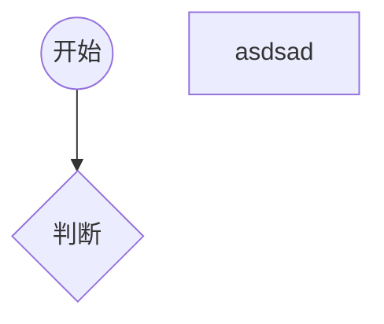

# 流程图

一套标准的图形，用于描述程序的逻辑

通常流程图分析程序的流程


> markdown中粘贴图片 ctrl + alt + v

## 在markdown中画流程图 - 前提装了markdown增强工具


vscode 快捷整理代码 shift + alt + f


# 数组

数组的本质就是对象 typeof [] -> 'object'  数组的下标都是字符串类型 不是数字

- length属性：数组的长度
- 数字字符串属性：下标也叫做索引，相当于数组中每个数据的编号

## 数组的常见操作

### 添加数组项

- 数组[长度] = 数据：向数组末尾添加一个数据
- 数据.push(数据)：向数组末尾添加一个数据
- 数组.unshift(数据)：向数组起始位置添加一个数据，会导致数组每一项的下标向后移动
- 数组.splice(下标，0，添加的数)：从指定下标的位置开始，删除0个，然后在该位置出入添加的数据

push、unshift、splice可以添加多个数据

### 删除数据

- delete 数组[下标]：这种做法不会导致数组其他的属性发生变化，因此，该做法会导致产生稀疏数组，所以不推荐使用
- 数组.pop()：删除数组的最后一项，该表达式返回数组最后一项的数据
- 数组.shift()：删除数组第一项，该表达式返回第一项的数据
- 数组.splice(下标，删除的数量，添加的数据)：从指定下标位置开始，删除指定数量，然后在该位置插入添加的数据，如果下标超出范围，则按照范围的边界进行处理。返回一个新的数组，该数组记录被删除的数据

### 其他操作

- 数组.slice(起始位置下标，结束位置下标)：将起始位置到结束位置之间的数据拿出来，得到一个新的数组，该函数不会改变原数组；
**注意：结束下标取不到**

下标可以取负数，如果是负数，则从数组的末尾开始计算由-1开始 - (-1 -> 倒数第一个) 只能从左到右取

如果不写结束下标，则直接取到末尾

- 数组清空
数组.splice(0,数组.length); -> 方法1
数组.length = 0;  -> 方法2

- 查找数组中某一项的下标
数组.indexOf(数据)
从数据中依次查找对应的**数据**，查找时采用严格相等进行比较。找到第一个匹配的**下标**返回。
如果没有找到则得到-1
如果有多个相应的数据，返回第一个相应的数据下标

数组.lastIndexOf(数据)

功能与indexOf类似，只是查找的是最后一个匹配的下标

- 数组.fill

数组.fill(数据)：将数组的所有项，填充为指定的数据

数组.fill(数据, 开始下标)：将数组从开始下标起，到数组的末尾，填充为指定的数据

数组.fill(数据, 开始下标 ,结束下标)：将数组从开始下标起，到数组的末结束下标(结束下标取不到)，填充为指定的数据

# in 关键字

作用：判断一个属性在对象中是否存在

属性名 in 对象

# for-in循环

```js
for(var porp in obj){
    // 循环体   
}
```
取出对象的所有属性名，每次循环都将其中一个属性名赋给变量prop，运行循环体

**for-in循环只能循环对象中有的属性，不能找到对象没有的属性，所以如果要给一个obj赋多个值，使用for循环而不是for-in循环**

# 函数

函数声明 
> function 函数名(){}; 会提升到代码块的最上面

函数体中如果遇到return语句机会直接结束运行

# 文档注释

/**
 * 
 *
*/

# 作用域与闭包

## 作用域

作用域表示一个代码区域，也表示一个运行环境 
js中有两种作用域：

1. 全局作用域

直接在脚本中书写的代码

在全局中**声明的变量**，会被升到脚本块的顶部 (注意是声明提升而不是声明赋值提升) ， 并且会成为全局对象的属性

2. 函数作用域

函数中的代码

在函数作用域中声明的变量，会被提升到函数的顶部，并且不会成为全局对象的属性

因此，在函数中声明的变量不会导致全局对象的污染  - 因此**尽量把功能封装在函数中**

但是，当函数称为一个表达式的时，它既不会提升，也不会污染全局对象

将一个函数变成一个表达式的方法之一：将函数用一个小括号括起来

(function 函数名()) - 变成一个表达式 但是不能通过函数名调用了

如果书写一个函数表达式，然后将之立即调用，那么该函数被称之为立即执行函数 IIFE (Imdiately Invoked Function Expression)

书写方式为 (function () {} ()) 或者 (function () {}) ()

由于大部分情况下，函数表达式的函数名是没有实际意义的，因此，可以省略函数名

没有名字的函数被称为 匿名函数 -> 只有在函数表达式中可使用

### 作用域中可以使用过的变量

全局作用域只能使用全局作用域中声明的变量 (包括函数)

函数作用域不仅能使用自身作用域的变量(包括函数)，还可以使用外部环境的变量(包括函数)

## 闭包

闭包 (closure) , 是一种现象，指内部函数可以使用外部函数环境中的变量

函数在js中是整体提升

## this关键字
> this 无法赋值

1. 在全局作用域中，this关键字固定指向全局对象。

2. 在函数作用域中，取决于函数是如何被调用的
   1. 函数直接调用，this指向全局对象
   2. 通过一个对象的属性调用，格式为```对象.属性()```或者```对象['属性']``` (常用) this指向对象

# 构造函数

> 对象中的属性，如果是一个函数，也称该属性为对象的方法

## 用于创建对象的函数

用函数创建对象 可以减少繁琐的对象创建流程

1. 函数返回一个对象 -> 每次创建的对象都是新的对象

对象中的属性名与属性值相等的时候有一个语法糖 - 可以简写成一个单词加逗号
对象中如果有函数也可以简写

比如
```
function obj (name , age , gender) {
    name: name - > name,
    age : age  - > age,
    gender: gender - > gender,
    sayhi(){
        //
    }
}
```

2. 构造函数：专门用于用于创建对象

```js
nwe 构造函数(参数);
```

如果使用上面的格式创建对象，则该函数叫做构造函数

1) 函数名使用大驼峰命名法
2) 构造函数内部，会自动创建一个新对象，this会指向新创建的对象，并自动返回新对象
3) 构造函数中如果出现返回值，如果返回的是原始类型，则直接忽略;如果是应用类型，则使用返回的值
4) js中所有的对象，最终都是通过构函数创建的
构造函数一定会返回一个对象
```js
var arr = [1,2,3,3,4] 本质上相当于 var arr = new Array([1,2,3,3,4]);
```
## new.target

该表达式在函数中使用，返回的是当前的构造函数，但是，如果该函数不是通过new调用的，则返回undefined

通常用于判断某个函数是否通过new在调用

# 函数的本质

函数的本质就是对象。

> 某些教程中，将构造函数称之为构造器

> 所有的对象都是通过关键字new出来的，```new 构造函数()```

所有的函数都是通过```new Function``` 创建

> function

由于函数本身就是对象，因此函数中，可以拥有各种属性。

## 包装类

js为了增强原始类型的功能，为boolean、string、number分别创建了一个构造函数：

1. Boolean
2. String
3. Number

这三个都是构造函数  

如果语法上将原始类型当作对象使用时(一般是在使用属性的时候),js会自动在该位置利用对应的构造函数，创建对象来访问原始类型的属性

> 类：在js中，可以认为类就是构造函数

> 成员属性(方法)、实例属性(方法)：表示该属性是通过构造函数创建的对象调用的
> 静态属性(方法)、类属性(方法)：表示该属性是通过构造函数本身调用的

## 递归

函数直接或间接调用自身 - 递归

避免无限递归，无限递归会导致执行栈溢出

对比死循环

- 死循环不会报错，也不会导致栈溢出
- 无限递归会导致栈溢出

### 执行栈 - 一块内存空间

任何代码的执行都必须要有一个执行环境，执行环境为代码的执行提供支持

执行环境是放在执行栈中

每个函数的调用，都需要创建一个函数的执行环境，函数调用结束，执行环境销毁

执行栈有相对固定的大小，如果执行环境太多，执行栈无法容纳，会报错

### 尾递归

如果一个函数最后一条语句是调用函数，并且调用函数不是表达式的一部分，则该语句称之为尾调用，如果尾调用是调用自身函数，则称为尾递归

某些语言或者执行环境会对尾递归进行优化，他们会立即销毁当前函数，避免执行栈空间被占用

但是**在浏览器执行环境中，尾调用没有优化** 但在node.js环境中会有优化

# 标准库

- 库: liberary
- API: 应用程序编程接口，Application Programing Interface
- 标准: ECMAScript标准

object 与 function 都是构造函数

## object

### 静态成员 - 通过构造函数调用 object.XXXX

- keys(某个对象)，得到某个对象的所有属性名组成的数组
- values(某个对象)，得到某个对象的所有属性值组成的数组
- entries(某个对象)，得到某个对象的所有属性名组与属性值成的数组

#### 实列成员 - 同构有构造函数new 后的对象来调用 obj.XXXX

> 实列成员可以被重写 被对象里属性重写

**所有对象都拥有object的所有实列成员**

- tostring方法：得到某个对象的字符串格式 默认情况下，该方法返回"[object Object]";

- valueOf方法：得到某个对象的值 默认情况下，返回该对象自身

在js中，当自动进行类型转换时，如果要对一个对象那个进行转换，实际上是先调用对象的valueOf方法，然后调用返回结果的tostring方法

**在js中如果调用valueOf后得到一个原始值后就不会再调用toString**

## function

**所有函数都具有function的所有实列成员**

**语法：arguments——在函数中使用，获取该函数调用时，传递的所有参数**

**arguments是一个类数组(也称为伪数组：没有通过Array构造函数创建的类似于数组结构的对象)，伪数组会缺失大量的数组实例方法**

**arguments数组中的值，会与对应的形参映射**

**必须要有参数传入才会与arguments数组形成映射**

### 实例成员

- length属性：得到函数形参数量
- apply方法：调用函数，同时指定函数中的this指向 参数以数组传递
- call方法：调用函数，同时指定函数中的this指向 参数以列表传递
- bind方法：得到一个新的函数，该函数中的this始终指向指定的值 (改变this后的函数需要多次调用的时候，使用这种方法)

通常，可以利用apply、call方法，将某个伪数组转换为真数组

## Array构造器

凡是通过Array构造函数创建的对象，都是数组 **所有的数组都是通过Array构造器构造的**

[1,e,234,35] 这样是一个语法糖 简写 实际也是调用了Array构造器

### 静态成员

- form(伪数组)方法：将一个伪数组转换为一个真数组
- isArray方法：判断一个给定的数据，是否是真数组
- Array.of()：根据一组数据来创建新的数组，支持任意的参数数量和类型 （类似于中括号创建数组，依次赋予数组每一项的值）

### 实列成员
最好查看MDN中的详细使用：https://developer.mozilla.org/zh-CN/docs/Web/JavaScript/Reference/Global_Objects/Array

常用的几种实列方法：（不需要背，知道有会用就行）
- fill方法：用某个数据填充数组的每一项 给数组的每一项赋一个相同的值的时候使用
- pop方法：删除数组的最后一个元素，并返回这个元素
- push方法：在数组的末尾增加一个或者多个元素，并返回数组的新长度
- reverse方法：颠倒当前数组中元素的排序，及第一个元素变为最后一个元素，最后一个元素变成第一个元素
- shift方法：删除数组的第一个元素，并返回这个元素
- sort方法：对当前数组元素进行排序，并返回当前数组 - (升序排序 - 不准确排序结果 - 排序方式是根据Unicode码点排序)
要使sort方法准确 使用回调函数
```js
var arr = [2,3445,677,43,13,56,67];
arr.sort(function (a,b){
    return a - b;
});
console.log(arr);

// 随机排序（洗牌）
arr.sort(function(a,b){
    // 返回值有可能为正有可能为负
    return Math.random() - 0.5;
});

console.log(arr);
```
- splice(起始下标，结束下标)方法：在任意位置给数组添加/删任意个元素
- unshift()方法：在数组的开头增加一个或者多个数组，并返回数组新的长度

- 访问方法：下面的这些方法绝对不会改变调用它们的对象的值，只会返回一个新的数组或者返回一个其它的期望值 - 纯函数、无副作用函数

- concat()方法：组合多个数组得到一个新的数组
- includes() es6新增哈方法：数组中是否包含满足条件的元素 返回Boolean值 数组中为对象无法查找到
- join
- slice
- indexOf
- lastIndexOf
- forEach：遍历数组
```js
var arr = [213,324,56,77,8];

arr.forEach(function (item , i , a){
    // item为数组的中的每一项 i为数组每一项的下标 a为整个数组
    console.log(item , i , a);
})
```
下面几个方法的参数都是传入函数
- every: 是否所有元素都满足条件
- some: 是否至少有一个元素满足条件
- fillter：过滤，得到满足条件的元素组成的新数组
- find：查找第一个满足条件的元素，返回元素本身，如果没有找到，返回undfined
- findIndex：查找第一个满足条件的元素，返回元素的下标
- map：映射，将数组的每一项映射称之为另外一项
```js
var arr = [22,44,56,78,97,34];

// 得到一个新的数组，新的数组的每一项是一个对象 对象的属性由原数组的每一项决定
// 对象中包含两个属性：name、score
var newArr1 = arr.map(function(item,i){
    return {
        name : "学生" + (i + 1),
        score : item 
    }
})
console.log(newArr1);
// 得到一个学生的姓名
var newArr2 = newArr.map(function(item){
    return item.name;
})

console.log(newArr2);
```
- reduce：统计、累计
```JS
var arr = [2,4,5,7,8,56];
// 求和 如果数组只有一项就会不运行直接输出
// 如果数组是空，可以在reduce中加入一个参数0 
// 这样为空返回0 数组只有一项时会执行一次回调函数 
var sum = arr.reduce(function(s,item){
    r eturn s + item
},0)
console.log(sum);
```
更多的可以查看**MDN文档**

# 原始类型包装器 
把原始了类型的数据通过构造函数转换为对象的形势

使用方式：

- new 包装(值)：返回一个对象
- 包装器(值)：返回的是一个原始类型的值 

详细查看MDN文档说明 它们的静态方法与实列方法

## Number

### 静态方法

- isNaN：判断以一个数是不是NaN
- isFinite: 判断一个是是不是有限的
- isInteger：判断一个数是否是整数
- parseFloat：将一个数据转化为浮点数
- parseInt：将一个数据转化为整数 直接去掉小数点后的部分

parseFloat、parseInt要求参数是一个字符串、如果不是字符串的，要先转化为字符串
从字符串开始位置查找，找到第一个有效数字进行转换，如果没有找到，则返回NaN,左右的空白字符会被忽略
parseFloat("3.24ff") = 3.24
parseFloat("abc123") = NaN

parseInt可以传入第二个参数，表示将给定的字符串给，识别为多少进制的数，转换为十进制
### 实列成员
- toFixed(参数)：保留所传参数位数的小数，会四舍五入

## Boolean

## String

### 静态成员

- formCharCode()：通过一串Unicode编码 创建字符串 参数为Unicode编码 65 - "A"

### 属性 - 看MDN文档

- 字符串本质是一个伪数组
- charAt：返回传入下标的字符
- charCodeAt：返回传入下标字符的Unicode的值
- concat()：连接两个字符串文本，并返回一个新的字符串
- includes：判断字符串是否包含参数字符串
- endWith：判断字符串是否以参数字符串结尾
- indexOf：返回传入字符串索引 - 首次出现
- lastindexOf：返回最后一个符合字符的索引
- padStart：在前面填充
- padEnd：在末尾填充
- repeat：把字符串循环参数次数输出
**以下三个都是常见的用于截取字符串的方法**
- slice：从某个位置开始取到某个位置 位置可以为负数
- substr：从某个位置开始取，取指定的长度 位置可以为负数
- substring：返回在字符串中指定两个下标之间的字符 位置不可以为负数 参数可以调换
**转换大小写**
- toLowerCase: 将字符串转换为小写
- toUpperCase：将字符串转换为大写

- trim：除去首尾空格

**重要的方法**
- split：分割字符串 返回一个真数组

# Math对象

> 常量: 永远不会变化的数据,命名时全部大写,多个单词用 "_" 分割

提供了一系列与数学相关的成员

- random(): 返回一个0 到 1 之间的随机小数
- PI属性: 得到圆周率
- abs(): 取绝对值
- floor(): 对一个数向下取整
- ceil(): 对一个数向上取整
- max/min(): 得到一组数字的最大值与最小值
- pow(): 求一个数字的幂次方 
- round(): 传入一个小数,正数范围内,四舍五入返回一个整数; 负数则是直接去掉小数后面的数

约定: max无参数 - 得到 -Infinity   min无参数 - 得到 Infinity


**重点**
# 正则表达式

https://c.runoob.com/front-end/854

正则表达式是国际标准,跨越语言

正则表达式是一个规则,用于验证字符串是否符合规则

## 基础

1. 字面量匹配

规则中直接书写字面量

2. 特殊字符
```
.
^
$

```
. : 表示除了换行外任何字符
^ : 表示字符串的开始
$ : 表示字符串的结束

3. 转义符
```
\n - 换行
\t - 制表符
\s - 任何空白字符
\S - 除空白字符外的任意
\b - 单词边界 - 有空白字符
\B - 非单词边界
\d - 匹配一个数字(0~9)
\D - 匹配一个非数字
\w - 匹配数字,字母,下划线 (一个)
\W - 与\w相反
\un - 匹配一个unicode编码

```

转义符可以将特殊字符转义

4. 字符集
```
[字符范围] - 匹配在范围内的字符 分别匹配 每次匹配一个
[a - z] - 匹配a到z的所有字符
[^字符范围] - 表示对字符范围取反

```
```

匹配中文: [\u4e00-\u9fa5]

```
5. 量词

```
* : 匹配任意次数 0~任意
+ : 一个或多个
? : 零个或者一个
{n} : 匹配n个
{n,} : 匹配>=n个
{n,m} : 匹配n到m个

```

6. 或者

多个规则之间,适用于```|```,表示多个规则任选其一

## js中的应用

js中,正则表达式表现为一个对象,该对象是通过构造函数RegExp创建的

### 创建正则表达式

1. 字面量模式

2. 构造函数模式

两种写法含义相同

```
var rule = /规则/gi; - 规则固定时
var rule1 = new RegExp("规则","gi"); - 规则不固定时

```
g - 标准位 表示全局搜索
i - 标准位 表示忽略大小写

### 正则实例成员（方法）

- global : 表示是否开启了全局搜索模式
- ignoreCase : 是否开启忽略大小写
- multiline : 是否开启多行匹配 (^与$)
- source : 返回当前规则
- test : 验证某个字符串是否满足规则
- exec : 执行匹配返回结果 返回的是一个真数组

> 正则表达式,默认情况下,适用于贪婪模式 尽可能多的匹配
> 在量词后面加上？则表示非贪婪模式  /\d+?/

### 字符串对象中的正则方法

- split
- replace
- search
- match

## 进阶

### 捕获组

用小括号包裹住的部分叫做捕获组，捕获组会出现在匹配结果中

捕获组可以命名，命名后叫做具名捕获组

非捕获组 - 只是把小括号当作一个整体来用 在括号中加上?: - (?:\d)

作用：
```
var s = '1998-09-13,2012-10-23,2020-06-15';
// 得到每一个日期，并且得到它们的年月日
var reg = /(\d{4})-(\d{1,2})-(\d{1,2})/g;
while(result = reg.exec(s)){
    console.log(result[0],result[1],result[2],result[3]);
}

```

### 反向引用

在正则表达式中使用某个捕获组 ```\捕获组编号```

详细例子看正则表达式中的代码中

### 正向断言(预查)

检查某个字符后面的字符是否满足某个规则，该规则不成为匹配结果，并且不成为捕获组

书写方式为：?= 

详细例子看正则表达式中的代码中

### 负向断言(预查)

检查某个字符后面的字符是否不满足某个规则，该规则不成为匹配结果，并且不成为捕获组

书写方式为：?!

# 错误处理

js中的错误分为两种：

1. 语法错误：会导致整个脚本块无法执行

2. 运行错误
    1. 运行报错 - 会导致当前代码块的后续代码无法执行
    2. 运行结果不符合预期

## 调试错误

1. 控制台打印 经典方式

2. 断点调试

## 抛出错误

在书写函数或者其他代码的时候，防止使用者错误的调用，抛出错误提醒他

在js中错误的本质就是对象，抛出错误的语法为

```js

throw 错误的对象;
throw new Error("");

```
错误对象的构造函数为Error


## 捕获错误

```js

try{
    // 代码块
}
catch(错误对象){
    // 代码块2
}
finally{
    // 代码块3
}

```

运行代码1的时候，如果发生错误，会立马停止代码1的执行，转而执行代码2，错误对象为抛出的错误对象
无论代码1和代码2是否执行，最终都要执行代码3
