# 变量提升
## js的栈内存执行
```js
console.log(a); // undefined 
var a = 13;
```
浏览器分配的线程是按照代码的先后顺序来执行的，但是上面的代码在var a变量之间就打印a，没有出错而是返回了undefined

这就是 - 变量提升：当栈内存(作用域)形成。JS代码自上而下执行之前。浏览器首先会把所有带‘var/function’ 关键词的进行提前“声明” 或者 “定义”，这种预先处理机制称之为“变量提升” **只是声明但没有赋值**

声明(declare)：var a (默认值为undefined)
定义(defined)：a = 13 (定义其实就是赋值操作)

[变量提升阶段]
> 带“VAR”的只声明未定义
> 带“FUNCTION”的声明和赋值都完成了 - 老版本浏览器会这样做

> 变量提升只发生在当前作用域（例如：开始加载页面的时候只对全局作用域下的进行提升，因为此时函数中存储的都是字符串而已）
> 在全局作用域下声明的函数或者变量是“全局变量”，同理，在私有作用域下声明的变量是“私有变量” [带VAR/FUNCTION的才是声明]
> 浏览器很懒，做过的事情不会重复执行第二遍，也就是，当代码执行遇到创建函数这部分代码后，直接的跳过即可（因为在提升阶段就已经完成函数的赋值操作了）

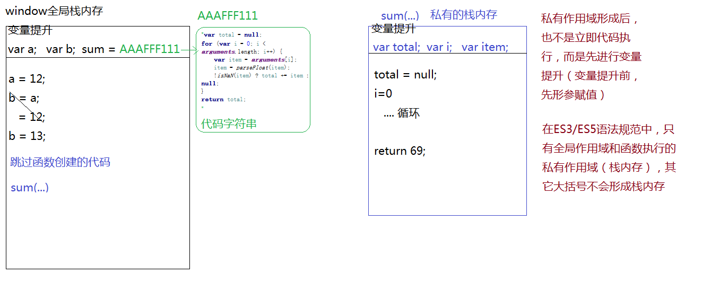

以上都是ES3/ES5的老版本语法规范 ES6跟它完全不一样

## 带 var 与不带 var 的区别
```js
//=>在全局作用域下声明一个变量，也相当于给WINDOW全局对象设置了一个属性，变量的值就是属性值（私有作用域中声明的私有变量和WINDOW没啥关系）

console.log(a);//=>undefined

console.log(window.a);//=>undefined

console.log('a' in window); //=>TRUE 在变量提升阶段，在全局作用域中声明了一个变量A，此时就已经把A当做属性赋值给WINDOW了，只不过此时还没有给A赋值，默认值UNDEFINED  in：检测某个属性是否隶属于这个对象

var a = 12;//=>全局变量值修改，WIN的属性值也跟着修改

console.log(a);//=>全局变量A  12

console.log(window.a);//=>WINDOW的一个属性名A  12

a = 13;
console.log(window.a);//=>13

window.a = 14;
console.log(a);//=>14
//=>全局变量和WIN中的属性存在 “映射机制”
window.a === a; // true
```
不带var时
```js
// 不加VAR的本质是WIN的属性
console.log(a);//=>Uncaught ReferenceError: a is not defined
console.log(window.a);//=>undefined
console.log('a' in window);//=>false

a = 12;//=>window.a=12
console.log(a);//=>12
console.log(window.a);//=>12

```
**加var那么后面的a本质就是一个变量因为映射关系而和window.a有关系**
**不加var，那么a的本质就时window的一个属性而不是变量**

```js
/*var a = 12,
    b = 13;//=>这样写B是带VAR的*/
/*var a = b = 12;//=>这样写B是不带VAR的*/

console.log(a, b);//=>undefined undefined
var a = 12,
    b = 12;

function fn() {
    console.log(a, b);//=>undefined 12
    var a = b = 13;
    /*var a=13;  b=13;*/
    console.log(a, b);//=>13 13
}

fn();
console.log(a, b);//=>12 13
```
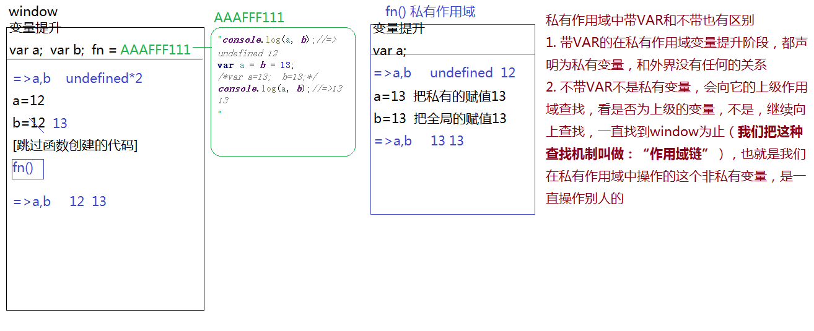

## 作用域链的扩展
```js
function fn() {
    /*
     * 变量提升：无
    */
    // console.log(b);//=>Uncaught ReferenceError: b is not defined
    b = 13;
    //console.log('b' in window);//=>true  在作用域链查找的过程中，如果找到WIN也没有这个变量，相当于给WIN设置了一个属性B (window.b=13)
    console.log(b);//=>13
}
fn();
console.log(b);//=>13
```

## 1-只对等号左边的进行变量提升

**匿名函数都不会进行变量提升**

```js
/*
 * 变量提升：
 *   var fn;   =>只对等号左边进行变量提升
 *   sum = AAAFFF111;
 */
sum();
fn();//=>Uncaught TypeError: fn is not a function

//=>匿名函数之函数表达式
var fn = function () {
    console.log(1);
};//=>代码执行到此处会把函数值赋值给FN

fn();

//=>普通的函数
function sum() {
    console.log(2);
}
```
## 2-条件判断下的变量提升
```js
/*
 * 在当前作用域下，不管条件是否成立都要进行变量提升
 *   带VAR的还是只声明
 *   带FUNCTION的在老版本浏览器渲染机制下，声明和定义都处理，但是为了迎合ES6中的块级作用域，新版浏览器对于函数（在条件判断中的函数），不管条件是否成立，都只是先声明，没有定义，类似于VAR
 */
/*
/*
 * 变量提升
 *   var a;  =>在全局作用域下声明的全局变量也相当于给WIN设置了一个属性 window.a=undefined
*/
console.log(a);//=>undefined
if ('a' in window) {
    var a = 100;
}
console.log(a);//=>100

/*
 * 变量提升：无
 */
f = function () {return true;};//=>window.f=...（TRUE）
g = function () {return false;};//=>window.g=...（FALSE）
~function () {
    /*
     * 变量提升：
     *   function g;  //=>g是私有变量
     */
    if (g() && [] == ![]) {//新版浏览器在提升阶段只会声明不会定义会报错=>Uncaught TypeError: g is not a function （此时的g是undefined） 而老版本浏览器中带var的只声明、带function会即声明又定义就不会报错
        //=>[]==![]：TRUE 
        // 会先进行![]的计算 ![] => false
        // 在进行等号的计算 [] == false  '相等运算会都变成数字来进行比较'
        // 0 == 0 => true
        f = function () {return false;};//=>把全局中的f进行修改 window.f=...（FALSE）
        function g() {return true;}
    }
}();
console.log(f());
console.log(g());
// 老版本浏览器最后的输出结果为两个false
```
## 3-条件判断下的变量提升到底有多坑
```js
/*
 * 变量提升：
 *   function fn;
 */
// console.log(fn);//=>undefined
if (1 === 1) {
    console.log(fn);
    //=>函数本身：当条件成立，进入到判断体中（在ES6中它是一个块级作用域）第一件事并不是代码执行，
    // 而是类似于变量提升一样，先把FN声明和定义了，也就是判断体中代码执行之前，FN就已经赋值了
    function fn() {
        console.log('ok');
    }
}
// console.log(fn);//=>函数本身
```
## 4-重名问题的处理
```js
// 1.带VAR和FUNCTION关键字声明相同的名字，这种也算是重名了（其实是一个FN，只是存储值的类型不一样）
/*
var fn = 12;
function fn() {
}
*/
// 2.关于重名的处理：如果名字重复了，不会重新的声明，但是会重新的定义（重新赋值）[不管是变量提升还是代码执行阶段皆是如此]
/*
 * 变量提升：
 *   fn = ...（1）
 *      = ...（2）
 *      = ...（3）
 *      = ...（4）
 */
fn();//=>4
function fn() {console.log(1);}
fn();//=>4
function fn() {console.log(2);}
fn();//=>4
var fn=100;//=>带VAR的在提升阶段只把声明处理了,赋值操作没有处理,所以在代码执行的时候需要完成赋值 FN=100
fn();//=>100() Uncaught TypeError: fn is not a function
function fn() {console.log(3);}
fn();
function fn() {console.log(4);}
fn();
```

## ES6中的新规定

## 5-LET创建的变量不存在变量提升
```js
/*
 * 在ES6中基于LET/CONST等方式创建变量或者函数,不存在变量提升机制
 *
 * 切断了全局变量和WINDOW属性的映射机制
 *
 * 在相同的作用域中，基于LET不能声明相同名字的变量（不管用什么方式在当前作用域下声明了变量，再次使用LET创建都会报错- 用var声明的变量 在一次用let来定义也会报错）
 *
 * 虽然没有变量提升机制，但是在当前作用域代码自上而下执行之前，浏览器会做一个重复性检测（语法检测）：自上而下查找当前作用域下所有变量，一旦发现有重复的，直接抛出异常，代码也不会在执行了（虽然没有把变量提前声明定义，但是浏览器已经记住了，当前作用域下有哪些变量）
 */
// console.log(a);//=>Uncaught ReferenceError: a is not defined Uncaught ReferenceError - 引用错误
// let a = 12;
// console.log(window.a);//=>undefined
// console.log(a);//=>12

let a = 12;
console.log(a);
let a = 13;//=>Uncaught SyntaxError: Identifier 'a' has already been declared
console.log(a);
/*b = 12;
console.log(b);//=>12
a = 12;//=>Uncaught ReferenceError: a is not defined
console.log(a);
let a = 13;
console.log(a);*/

let a = 10,
    b = 10;
let fn = function () {
    console.log(a, b);//=>Uncaught ReferenceError: a is not defined
    let a = b = 20;
    /*
     * let a=20;
     * b=20; //=>把全局中的 b=20
     */
    console.log(a, b);
};
fn();
console.log(a, b);
```
ES6中 let与之前var的区别(一部分)：
- 不存在变量提升机制
- 不允许出现重复定义
- 不会暂时性死区

## 6-暂时性死区
```js
/*
var a = 12;
if (true) {
    console.log(a);//=>Uncaught ReferenceError: a is not defined
    let a = 13;//=>基于LET创建变量，会把大部分{}当做一个私有的块级作用域（类似于函数的私有作用域），在这里也是重新检测语法规范，看一下是否是基于新语法创建的变量，如果是按照新语法规范来解析
}
*/

/*
// console.log(a);//=>Uncaught ReferenceError: a is not defined
console.log(typeof a);//=>"undefined" 在原有浏览器渲染机制下,基于typeof等逻辑运算符检测一个未被声明过的变量，不会报错，返回UNDEFINED - 这就是暂时性死区
*/

// console.log(a);//=>Uncaught ReferenceError: a is not defined
console.log(typeof a);//=>Uncaught ReferenceError: a is not defined
let a;//=>如果当前变量是基于ES6语法处理，在没有声明这个变量的时候，使用TYPEOF检测会直接报错，不会是UNDEFINED，解决了原有的JS的死区
```
# 闭包问题

## 全局变量与私有变量
```js
/*
 * 变量提升：
 *    var a;  var b;  var c;
 *    fn = xxx...
 */
var a = 12,
    b = 13,
    c = 14;
function fn(a) {
    /*
     * 形参赋值
     *   a = 12
     *
     * 变量提升
     *   var b;
     *
     * =>在私有作用域中，只有以下两种情况是私有变量
     *  A:声明过的变量(带VAR/FUNCTION)
     *  B:形参也是私有变量
     *
     *  剩下的都不是自己私有的变量，都需要基于作用域链的机制向上查找
     */
    console.log(a, b, c);//=>12 undefined 14(C是全局的)
    var b = c = a = 20;
    /*
     var b=20;
     c=20; =>把全局的C修改为20
     a=20; =>这里修改的这是形参a 而不是修改外面的变量a
     */
    console.log(a, b, c);//=>20*3
}

fn(a);//=>把FN执行(小括号中是实参:值) =>执行FN把全局变量A的值12当做实参传递给函数的形参 =>fn(12)
console.log(a, b, c);//=>12 13 20
```
一个很经典的练习题
```js
var ary = [12, 23];

function fn(ary) {
    console.log(ary);
    ary[0] = 100;
    ary = [100]; // 这一步创建了一个新的数组 也就有了新的引用值
    ary[0] = 0;
    console.log(ary);
}

fn(ary);
console.log(ary);

// (2) [12, 23]
// [0]
// (2) [100, 23]
```
画图解释：
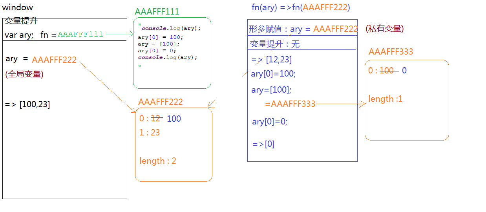

## 1-查找上级作用域
```js
/*
 * 当前函数执行，形成一个私有作用域A，A的上级作用域是谁，和他在哪执行的没有关系，和他在哪创建（定义）的有关系，在哪创建的，它的上级作用域就是谁
 */
/*
var a = 12;
function fn() {
    //=>arguments:实参集合
    //=>arguments.callee:函数本身FN
    //=>arguments.callee.caller:当前函数在哪执行的,caller就是谁(记录的是它执行的宿主环境),在全局下执行caller的结果是NULL
    console.log(arguments.callee.caller);
    // 在实际编程中这两个都不让用
}
function sum() {
    var a = 120;
    fn();
}
function aa() {
    fn();
}
aa();
*/

var n = 10;
function fn() {
    var n = 20;
    function f() {
        n++;
        console.log(n);
    }
    f();
    return f;
}
// 注意点：当前函数执行，形成一个私有作用域A，A的上级作用域是谁，和他在哪执行的没有关系，和他在哪创建（定义）的有关、/// 系，在哪创建的，它的上级作用域就是谁
// f是子fn中创建的它的作用域上一级是fn里的定义的变量再上一层才是全局变量
var x = fn(); // 21 
x(); // 22
x(); // 23
console.log(n); // 10
```
上面代码的图解：
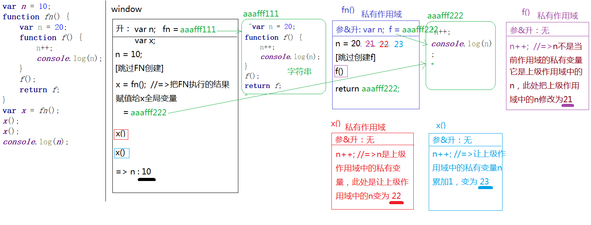

## 2-JS中的堆栈内存释放
```js
/*
 * JS中的内存分为堆内存和栈内存
 *   堆内存：存储引用数据类型值（对象：键值对  函数：代码字符串）
 *   栈内存：提供JS代码执行的环境和存储基本类型值
 *
 * [堆内存释放]
 *   让所有引用堆内存空间地址的变量赋值为null即可（没有变量占用这个堆内存了，浏览器会在空闲的时候把它释放掉）
 *
 * [栈内存释放]
 *   一般情况下，当函数执行完成，所形成的私有作用域（栈内存）都会自动释放掉（在栈内存中存储的值也都会释放掉），但是也有特殊不销毁的情况：
 *   1.函数执行完成，当前形成的栈内存中，某些内容被栈内存以外的变量占用了，此时栈内存不能释放（一旦释放外面找不到原有的内容了）
 *   2.全局栈内存只有在页面关闭的时候才会被释放掉
 *   ...
 *   如果当前栈内存没有被释放，那么之前在栈内存中存储的基本值也不会被释放，能够一直保存下来
*/
var i = 1;
function fn(i) {
    return function (n) {
        console.log(n + (++i));
    }
}
var f = fn(2);
f(3);
fn(5)(6);
fn(7)(8);
f(4);

// 在和其它值进行运算的时候有一些区别 ++在前总体得自加之后的值 ++在后得总体自加之前的值
var i = 1;
console.log(1 + ++i); // 3
i = 1;
console.log(1 + i++); // 2
// i++:自身累加1 （先拿原有值进行运算，运算结束后，本身累加1）
// ++i:自身累加1 （先自身累加1，拿累加后的结果进行运算）
var k = 1;
console.log(5 + (k++), k);// 6 2
k = 1;
console.log(5 + (++k), k);// 7 2

// 思考题:
var k = 1;
console.log(5 + (++k) + (k++) + 4 + (k--) + (++k) + 3 + (--k) + (k++), k);
```
图解上面的值
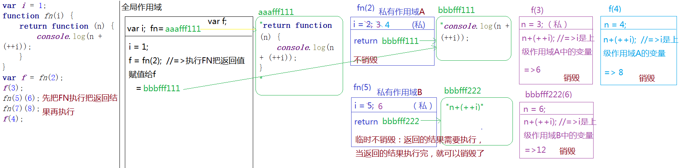
## 一道综合题
```js
var i = 2;
function fn() {
    i += 2;
    return function (n) {
        console.log(n + (--i));
    }
}
var f=fn();
f(2);
f(3);
fn()(2);
fn()(3);
f(4);
```

## 3-闭包应用
```js
/*
 * [闭包]
 *   =>函数执行时会形成一个私有的作用域，保护里面的私有变量不受外界的干扰，这种保护机制称之为“闭包”
 *
 *   =>市面上的开发者认为的闭包是：形成一个不销毁的私有作用域（私有栈内存）才是闭包
 */
/*
//=>闭包：柯理化函数
function fn() {
    return function () {

    }
}
var f = fn();
*/
/*
//=>闭包：惰性函数
var utils = (function () {
    return {

    }
})();
*/
//=>闭包项目实战应用
//==>真实项目中为了保证JS的性能（堆栈内存的性能优化），应该尽可能的减少闭包的使用（不销毁的堆栈内存是耗性能的）
//1.闭包具有“保护”作用：保护私有变量不受外界的干扰
//在真实项目中，尤其是团队协作开发的时候，应当尽可能的减少全局变量的使用，以防止相互之前的冲突（“全局变量污染”），那么此时我们完全可以把自己这一部分内容封装到一个闭包中，让全局变量转换为私有变量
/*
(function () {
    var n = 12;
    function fn() {

    }
    //...
})();
*/
//> 不仅如此，我们封装类库插件的时候，也会把自己的程序都存放到闭包中保护起来，防止和用户的程序冲突，但是我们又需要暴露一些方法给客户使用，这样我们如何处理呢？
//1.JQ这种方式：把需要暴露的方法抛到全局
/*
(function () {
    function jQuery() {
        //...
    }

    //...
    window.jQuery = window.$ = jQuery; //=>把需要供外面使用的方法，通过给WIN设置属性的方式暴露出去
    // 这也是我们可以通过$来使用jquery的原因
})();
// jQuery();
// $();
*/
//2.Zepto这种方式：基于RETURN把需要共外面使用的方法暴露出去 Zepto也是一个类似于jQuery的库
// 单列模式
/*
var Zepto=(function () {
    //...
    return {
        xxx:function () {

        }
    };
})();
Zepto.xxx();
*/
//2.闭包具有“保存”作用：形成不销毁的栈内存，把一些值保存下来，方便后面的调取使用
```

### let与var的区别
```js
//=>基于ES6中的LET来创建变量,是存在块级作用域的(类似于私有作用域)
//作用域：（栈内存）
//1.全局作用域
//2.私有作用域（函数执行）
//3.块级作用域（一般用大括号包起来的都是块级作用域，前提是ES6语法规范）
/*
{
    let a = 12;
    console.log(a);//=>12
}
console.log(a);//=>Uncaught ReferenceError: a is not defined
*/

/*let a = 100;
{
    let a = 100;
    {
        {
            console.log(a);//=>100
        }
    }
}
*/

if (1 === 1) {
    //=>判断体也是块级作用域
    let a = 12;
}
console.log(a);//=>Uncaught ReferenceError: a is not defined*/

for (let i = 0; i < 5; i++) {
    //=>循环体也是块级作用域，初始值设置的变量是当前本次块级作用域中的变量(形成了五个块级作用域，每个块级作用域中都有一个私有变量I，变量值就是每一次循环I的值)
}
console.log(i);//=>Uncaught ReferenceError: i is not defined

// var obj={};//=>对象的大括号不是块级作用域
```
# 面向对象编程 (Object oriented Programming)

## 单例设计模式 (SingLeton Pattern)
```JS
/*
 * 单例设计模式（singleton pattern）
 *  1.表现形式
 *  var obj = {
 *      xxx:xxx,
 *      ...
 *  };
 *  在单例设计模型中,OBJ不仅仅是对象名,它被称为“命名空间[NameSpace]”，把描述事务的属性存放到命名空间中，多个命名空间是独立分开的，互不冲突
 *
 *  2.作用
 *  =>把描述同一件事务的属性和特征进行“分组、归类”(存储在同一个堆内存空间中)，因此避免了全局变量之间的冲突和污染
 *  var pattern1={name:'xxx'}
 *  var pattern2={name:'xxx'}
 *
 *  3.单例设计模式命名的由来
 *  =>每一个命名空间都是JS中Object这个内置基类的实例，而实例之间是相互独立互不干扰的，所以我们称它为“单例：单独的实例”
 */

/*
var name = "陆相莹";
var age = 18;
var sex = "girl";

var name = "刘司南";
var age = 81;
var sex = "boy";
*/

/*
var person1={
    name:"陆相莹",
    age:18
};
var person2={
    name:"刘司南",
    age:81
};*/

/*
 * 高级单例模式 - 在面试和开发工作中经常使用到的
 *   1.在给命名空间赋值的时候，不是直接赋值一个对象，而是先执行匿名函数，形成一个私有作用域AA（不销毁的栈内存），在AA中创建一个堆内存，把堆内存地址赋值给命名空间
 *
 *   2.这种模式的好处：我们完全可以在AA中创造很多内容（变量OR函数），哪些需要供外面调取使用的，我们暴露到返回的对象中（模块化实现的一种思想）
 */
/*var nameSpace = (function () {
    var n = 12;
    function fn() {
        //...
    }
    function sum() {

    }
    return {
        fn: fn,
        sum: sum
    }
})();*/

/*
 * THIS
 *   1.给当前元素的某个事件绑定方法, 当事件触发方法执行的时候，方法中的THIS是当前操作的元素对象
 *   oBox.onclick=function(){
 *      //=>this:oBox
 *   }
 *
 *   2.普通函数执行，函数中的THIS取决于执行的主体，谁执行的，THIS就是谁（执行主体：方法执行，看方法名前面是否有“点”，有的话，点前面是谁this就是谁，没有this是window）
 *   function fn(){//=>AAAFFF000
        console.log(1);
     }
     var obj={
        fn:fn //=>fn:AAAFFF000
     };

     //=>执行的是相同的方法（不同地方在于函数执行方法中的this是不一样的）
     obj.fn();//=>this:obj
     fn();//=>this:window

     //=>自执行函数执行，方法中的this是window
     ~function(){
         //=>this:window
     }();
*/

var n = 2;
var obj={
    n:3,
    fn:(function (n) {
        n*=2; // 形参2
        this.n+=2; // window全局的n
        var n=5;
        return function (m) {
            this.n*=2;
            console.log(m + (++n));
            // ++n的n不是前面this.n的n ++n的n是上级作用域的n
        }
    })(n)//=>obj.n会报错
};
var fn = obj.fn;
fn(3);
obj.fn(3);
console.log(n, obj.n);
```
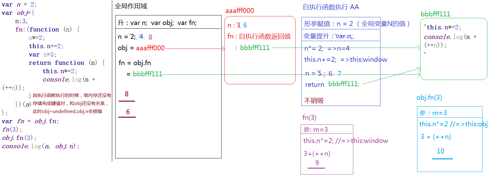

## 基于单例模式实现模块开发
```js
/*
 * 模块化开发
 *   1.团队协作开发的时候，会把产品按照功能板块进行划分，每一个功能板块有专人负责开发
 *   2.把各个版块之间公用的部门进行提取封装，后期在想实现这些功能，直接的调取引用即可（模块封装）
 */

var utils=(function () {
    return {
        aa:function () {

        }
    }
})();

//=>少帅
var skipRender = (function () {
    var fn = function () {
        //...
    };
    //...
    return {
        init: function () {

        },
        fn:fn
    }
})();
skipRender.init();

//=>敏洁
var weatherRender = (function () {
    var fn = function () {

    };
    return {
        init: function () {
            fn();//=>调取自己模块中的方法直接调取使用即可
            skipRender.fn();//=>调取别人模块中的方法
        }
    }
})();
weatherRender.init();
```

## 工厂模式 - Factory Pattern
```js
/*
 * 工厂模式（Factory Pattern）
 *   1.把实现相同功能的代码进行“封装”，以此来实现“批量生产”（后期想要实现这个功能，我们只需要执行函数即可）
 *
 *   2.“低耦合高内聚”：减少页面中的冗余代码，提高代码的重复使用率
 */

function createPerson(name, age) {
    var obj = {};
    obj.name = name;
    obj.age = age;
    return obj;
}

var p1 = createPerson('xxx', 25);
var p2 = createPerson('xxx', 25);
```

## 面向对象编程 - Object oriented Programming
JS是一门编程语言(具备编程思想)
>  [面向对象]
>   JS\JAVA\PHP\C#\Ruby\Python\C++...
> [面向过程]
>   C
面向对象编程，需要我们掌握：“对象、类、实例” 的概念
  对象：万物皆对象
  类：对象的具体细分（按照功能特点进行分类：大类、小类）
  实例：类中具体的一个事物（拿出类别中的具体一个实例进行研究，那么当前类别下的其它实例也具备这些特点和特征）
整个JS就是基于面向对象设计和开发出来的语言，我们学习和实战的时候也要按照面向对象的思想去体会和理解

### JS中的内置类
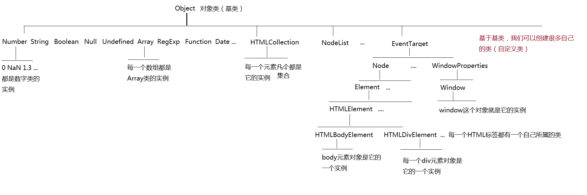

### 基于构造函数创建自定义类（constructor）
```js
/*
 * 基于构造函数创建自定义类（constructor）
 *   1.在普通函数执行的基础上“new xxx()”，这样就不是普通函数执行了，而是构造函数执行，当前的函数名称之为“类名”，接收的返回结果是当前类的一个实例
 *
 *   2.自己创建的类名，最好第一个单词首字母大写
 *
 *   3.这种构造函数设计模式执行，主要用于组件、类库、插件、框架等的封装，平时编写业务逻辑一般不这样处理
 */
/*
function Fn() {

}

// Fn();//=>普通函数执行
var f = new Fn();//=>Fn是类 f是类的一个实例
var f2 = new Fn();//=>f2也是Fn的一个实例，f2和f是独立分开的，互不影响*/

/*
 * JS中创建值有两种方式
 *   1.字面量表达式
 *   2.构造函数模式
 */
// var obj = {};//=>字面量方式
// var obj = new Object();//=>构造函数模式
// //=>不管是哪一种方式创造出来的都是Object类的实例，而实例之间是独立分开的，所以 var xxx={} 这种模式就是JS中的单例模式

//=>基本数据类型基于两种不同的模式创建出来的值是不一样的
//> 基于字面量方式创建出来的值是基本类型值
//> 基于构造函数创建出来的值是引用类型
//->NUM2是数字类的实例，NUM1也是数字类的实例，它只是JS表达数字的方式之一，都可以使用数字类提供的属性和方法
// var num1 = 12;
// var num2 = new Number(12);
// console.log(typeof num1);//=>"number"
// console.log(typeof num2);//=>"object"

//=================================

/*function Fn(name, age) {
    var n = 10;
    this.name = name;
    this.age = age + n;
}

//=>普通函数执行
/!*
//1.形成一个私有的作用域
//2.形参赋值
//3.变量提升
//4.代码执行
//5.栈内存释放问题
Fn();
*!/

//=>构造函数执行
var f1 = new Fn('xxx', 20);
var f2 = new Fn('aaa', 30);

console.log(f1 === f2);//=>false：两个不同的实例（两个不同的堆内存地址）
console.log(f1.age);//=>30
console.log(f2.name);//=>'aaa'
console.log("name" in f1);//=>true name&age在两个不同的实例都有存储，但是都是每个实例自己私有的属性
console.log(f1.n);//=>undefined 只有this.xxx=xxx的才和实例有关系,n是私有作用域中的一个私有变量而已（this是当前类的实例）*/


/*
 * 构造函数执行，不写RETURN，浏览器会默认返回创建的实例，但是如果我们自己写了RETURN？
 *   1.return是的一个基本值，返回的结果依然是类的实例，没有受到影响
 *   2.如果返回的是引用值，则会把默认返回的实例覆盖，此时接收到的结果就不在是当前类的实例了
 *
 *   =>构造函数执行的时候，尽量减少RETURN的使用，防止覆盖实例
 */
function Fn() {
    var n = 10;
    this.m = n;
    // return;//=>这样RETURN是结束代码执行的作用，并且不会覆盖返回的实例
    // console.log(1);
}

var f = new Fn();//=>new Fn;  在构造函数执行的时候，如果Fn不需要传递实参，我们可以省略小括号，意思还是创建实例（和加小括号没有区别）
console.log(f);

//=>instanceof：检测某一个实例是否隶属于这个类
// console.log(f instanceof Fn);//=>TRUE
// console.log(f instanceof Array);//=>FALSE
// console.log(f instanceof Object);//=>TRUE （万物皆对象：所有的对象，包含创建的实例都是Object的实例）

//=>in:检测当前对象是否存在某个属性（不管当前这个属性是对象的私有属性还是公有属性，只要有结果就是TRUE）
// console.log('m' in f);//=>TRUE
// console.log('n' in f);//=>FALSE
// console.log('toString' in f);//=>TRUE toString是它的公有属性

//=>hasOwnProperty：检测当前属性是否为对象的私有属性（不仅要有这个属性，而且必须还是私有的才可以）
// console.log(f.hasOwnProperty('m'));//=>TRUE
// console.log(f.hasOwnProperty('n'));//=>FALSE 连这个属性都没有
// console.log(f.hasOwnProperty('toString'));//=>FALSE 虽然有这个属性但是不是私有的属性

//=>思考题：编写一个方法hasPubProperty，检测当前属性是否为对象的公有属性，和hasOwnProperty对应
function hasPubProperty(obj, attr) {
    //=>OBJ:要检测的对象
    //=>ATTR:要检测的属性
    //...
}
hasPubProperty(f, 'm');//=>FALSE
hasPubProperty(f, 'n');//=>FALSE
hasPubProperty(f, 'toString');//=>TRUE
```
js中构造函数的执行机制
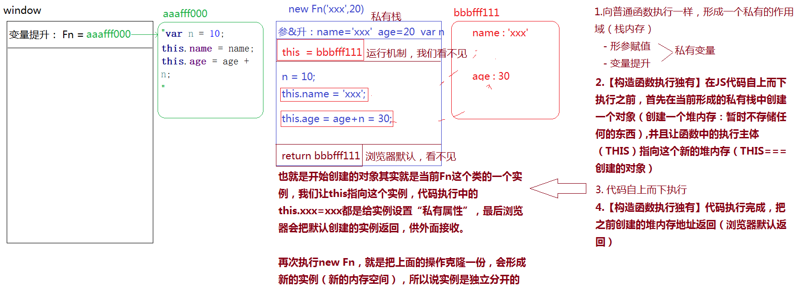
```js
/*
 * 基于构造函数创建自定义类（constructor）
 *   1.在普通函数执行的基础上“new xxx()”，这样就不是普通函数执行了，而是构造函数执行，当前的函数名称之为“类名”，接收的返回结果是当前类的一个实例
 *
 *   2.自己创建的类名，最好第一个单词首字母大写
 *
 *   3.这种构造函数设计模式执行，主要用于组件、类库、插件、框架等的封装，平时编写业务逻辑一般不这样处理
 */
/*function Fn() {

}

// Fn();//=>普通函数执行
var f = new Fn();//=>Fn是类 f是类的一个实例
var f2 = new Fn();//=>f2也是Fn的一个实例，f2和f是独立分开的，互不影响*/

/*
 * JS中创建值有两种方式
 *   1.字面量表达式
 *   2.构造函数模式
 */
// var obj = {};//=>字面量方式
// var obj = new Object();//=>构造函数模式
// //=>不管是哪一种方式创造出来的都是Object类的实例，而实例之间是独立分开的，所以 var xxx={} 这种模式就是JS中的单例模式

//=>基本数据类型基于两种不同的模式创建出来的值是不一样的
//> 基于字面量方式创建出来的值是基本类型值
//> 基于构造函数创建出来的值是引用类型
//->NUM2是数字类的实例，NUM1也是数字类的实例，它只是JS表达数字的方式之一，都可以使用数字类提供的属性和方法
// var num1 = 12;
// var num2 = new Number(12);
// console.log(typeof num1);//=>"number"
// console.log(typeof num2);//=>"object"

//=================================

/*function Fn(name, age) {
    var n = 10;
    this.name = name;
    this.age = age + n;
}
//=>普通函数执行
/*
//1.形成一个私有的作用域
//2.形参赋值
//3.变量提升
//4.代码执行
//5.栈内存释放问题
Fn();
*/
//=>构造函数执行
var f1 = new Fn('xxx', 20);
var f2 = new Fn('aaa', 30);

console.log(f1 === f2);//=>false：两个不同的实例（两个不同的堆内存地址）
console.log(f1.age);//=>30
console.log(f2.name);//=>'aaa'
console.log("name" in f1);//=>true name&age在两个不同的实例都有存储，但是都是每个实例自己私有的属性
console.log(f1.n);//=>undefined 只有this.xxx=xxx的才和实例有关系,n是私有作用域中的一个私有变量而已（this是当前类的实例）*/


/*
 * 构造函数执行，不写RETURN，浏览器会默认返回创建的实例，但是如果我们自己写了RETURN？
 *   1.return是的一个基本值，返回的结果依然是类的实例，没有受到影响
 *   2.如果返回的是引用值，则会把默认返回的实例覆盖，此时接收到的结果就不在是当前类的实例了
 *
 *   =>构造函数执行的时候，尽量减少RETURN的使用，防止覆盖实例
*/
function Fn() {
    var n = 10;
    this.m = n;
    // return;//=>这样RETURN是结束代码执行的作用，并且不会覆盖返回的实例
    // console.log(1);
}

var f = new Fn();//=>new Fn;  在构造函数执行的时候，如果Fn不需要传递实参，我们可以省略小括号，意思还是创建实例（和加小括号没有区别）
console.log(f);
//=>instanceof：检测某一个实例是否隶属于这个类
// console.log(f instanceof Fn);//=>TRUE
// console.log(f instanceof Array);//=>FALSE
// console.log(f instanceof Object);//=>TRUE （万物皆对象：所有的对象，包含创建的实例都是Object的实例）

//=>in:检测当前对象是否存在某个属性（不管当前这个属性是对象的私有属性还是公有属性，只要有结果就是TRUE）
// console.log('m' in f);//=>TRUE
// console.log('n' in f);//=>FALSE
// console.log('toString' in f);//=>TRUE toString是它的公有属性

//=>hasOwnProperty：检测当前属性是否为对象的私有属性（不仅要有这个属性，而且必须还是私有的才可以）
// console.log(f.hasOwnProperty('m'));//=>TRUE
// console.log(f.hasOwnProperty('n'));//=>FALSE 连这个属性都没有
// console.log(f.hasOwnProperty('toString'));//=>FALSE 虽然有这个属性但是不是私有的属性

//=>思考题：编写一个方法hasPubProperty，检测当前属性是否为对象的公有属性，和hasOwnProperty对应
function hasPubProperty(obj, attr) {
    //=>OBJ:要检测的对象
    //=>ATTR:要检测的属性
    //...
}
hasPubProperty(f, 'm');//=>FALSE
hasPubProperty(f, 'n');//=>FALSE
hasPubProperty(f, 'toString');//=>TRUE
```
## 原型与原型链

```JS
/*
 * 原型（prototype）、原型链（__proto__）
 *
 *  [函数]
 *    普通函数、类（所有的类:内置类、自己创建的类）、Date是函数(它的实例是一个对象)
 *
 *  [对象]
 *    普通对象、数组、正则、Math、arguments...
 *    实例是对象类型的(除了基本类型的字面量创建的值)
 *    prototype的值也是对象类型的 - (原型类)
 *    函数也是对象类型的
 *    ...
 *
 *  1.所有的函数数据类型都天生自带一个属性：prototype（原型），这个属性的值是一个对象，浏览器会默认给它开辟一个堆内存
 *  2.在浏览器给prototype开辟的堆内存中有一个天生自带的属性：constructor，这个属性存储的值是当前函数本身
 *  3.每一个对象都有一个__proto__的属性，这个属性指向当前实例所属类的prototype（如果不能确定它是谁的实例，都是Object的实例）
 */

function Fn() {
    var n = 100;
    this.AA = function () {
        console.log(`AA[私]`);
    };
    this.BB = function () {
        console.log(`BB[私]`);
    };
}
Fn.prototype.AA = function () {
    console.log(`AA[公]`);
};

var f1 = new Fn;
var f2 = new Fn;

console.log(f1.n);
```
从堆内存方面来解释原型与原型链
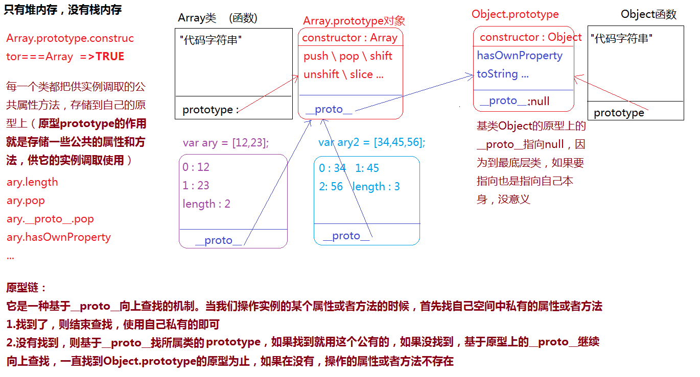
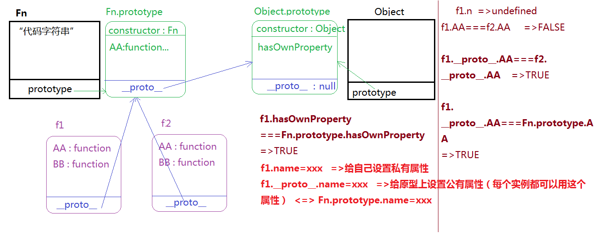

几张更好理解原型与原型链的图
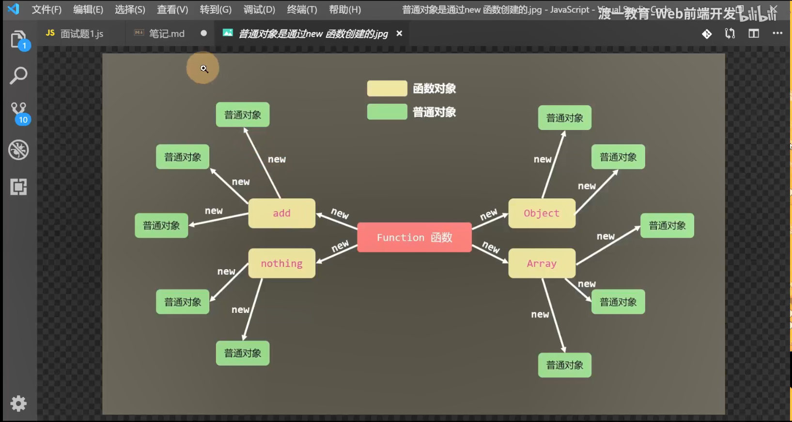
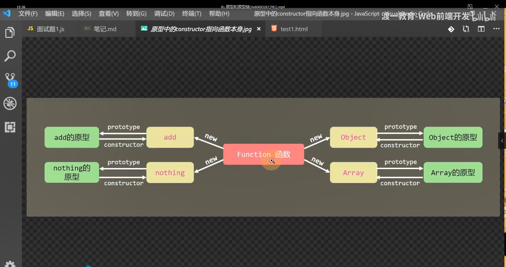
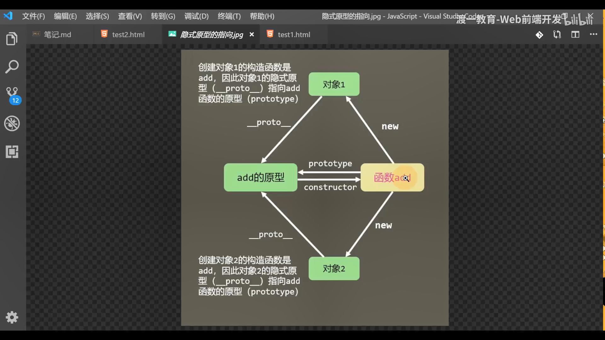
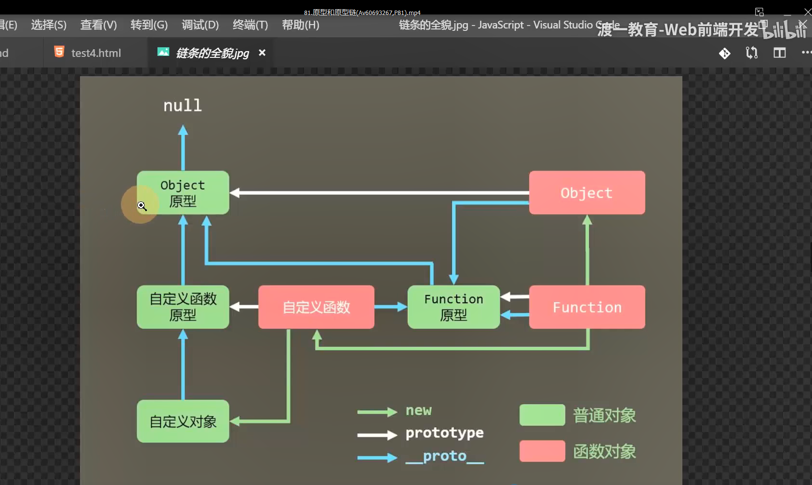

由一个题来检测原型链与原型
原型与原型链的总汇知识
- 1.每一个函数(类)都有一个prototype(原型)属性,属性值是一个对象：这个对象中存储了当前类供实例调取使用的公有属性和方法
- 2.在“浏览器默认”给原型开辟的堆内存中有一个属性constructor：存储的是当前类本身
- 3.每一个对象(实例)都有一个__proto__(原型链)属性，这个属性指向当前实例所属类的原型（不确定所属的类，都指向Object.prototype）

```js
function Fn() {
    this.x = 100;
    this.y = 200;
    this.getX = function () {
        console.log(this.x);
    }
}
Fn.prototype.getX = function () {
    console.log(this.x);
};
Fn.prototype.getY = function () {
    console.log(this.y);
};
var f1 = new Fn;
var f2 = new Fn;
console.log(f1.getX === f2.getX);//=>false
console.log(f1.getY === f2.getY);//=>true
console.log(f1.__proto__.getY === Fn.prototype.getY);//=>true
console.log(f1.__proto__.getX === f2.getX);//=>false
console.log(f1.getX === Fn.prototype.getX);//=>false
console.log(f1.constructor);//=>Fn
console.log(Fn.prototype.__proto__.constructor);//=>Object
f1.getX();//=>this:f1  =>console.log(f1.x);  =>100
f1.__proto__.getX();//=>this:f1.__proto__  =>console.log(f1.__proto__.x); =>undefined
// getX() 函数里面是console.log(this.x) 前面有点 打印f1.__proto__的X 而它没有所有为undefined
f2.getY();//=>this:f2  =>console.log(f2.y); =>200
Fn.prototype.getY();//=>this:Fn.prototype  =>console.log(Fn.prototype.y); =>undefined
```
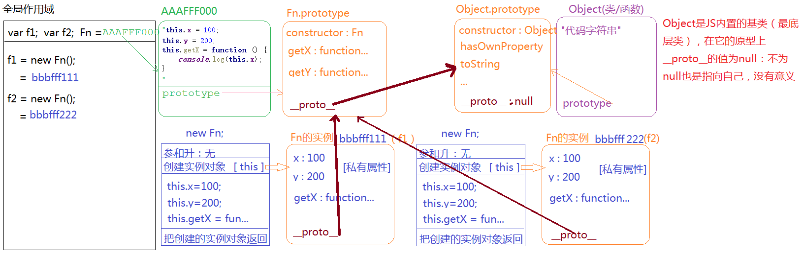