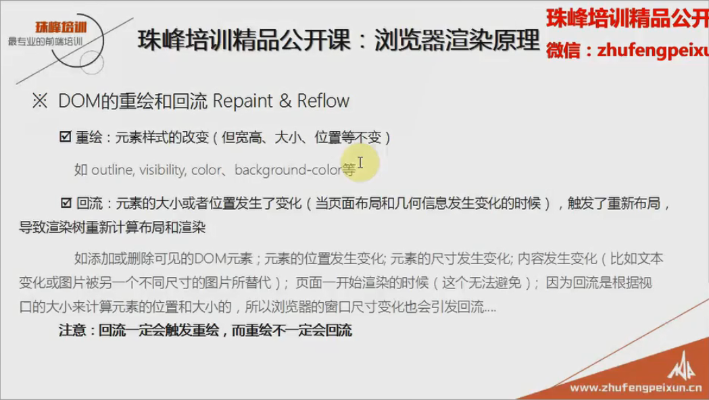
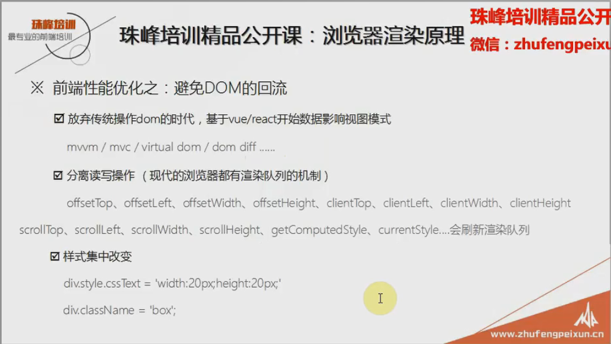

# 浏览器渲染原理

源于一道面试题: 请说出 - 从用户在浏览器地址栏输入网址，到看到整个页面，中间都发生了那些事？
大体上分为三个阶段：

1. HTTP请求阶段

2. HTTP响应阶段

3. 浏览器渲染阶段(这次笔记的重点)

基本知识：进程 Process  线程 Thread   栈内存 Stack

------

------

性能优化：减少http请求次数和大小 - 减少外联css的数量和压缩外部资源的大小
1. 资源合并压缩
2. 图片懒加载：一开始生成d渲染树的时候不加载，等到整个页面加载出来后滚动到那个屏幕再去加载图片
3. 音视频走流文件

## DOM的重绘和回流 回流也叫重排

优化的第二条：尽可能的减少页面的重绘和回流

现代浏览器的渲染队列机制就是指 - 当在js中有关于修改样式得代码时它不会马上执行而是看下一行是不是也是修改样式的如果是再看下一行之前没执行的都加入一个队列中直到下一行代码不是修改样式的把之前队列中的一次执行

分离读写就是把读取操作和写入操作分开不要写在一起

