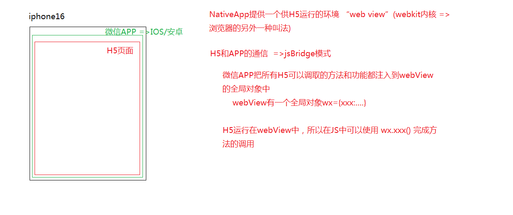

# Zepto
移动端开发中，我们在编写js代码的时候类似于在pc端使用JQ一样，也会使用一个js类库来辅助我们完成开发工作，我们使用的这个类库就是 - Zepto 它的使用方法也JQ一样，使用script标签引入到页面中，就可以使用了。

ZEPTO 与 JQ 的区别
1.ZEPTO没有考虑浏览器的兼容，专门为移动端开发的小型类库，也仅仅是把JQ中的一些常规方法实现了，很多方法也没有实现（例如：slideDown/show...在ZEPTO中都没有） =>为了保证ZEPTO的体积足够小

2.ZEPTO中提供了移动端专门操作的事件方法(例如：tap等)，这些方法都是基于移动端的TOUCH和GESTURE事件模型封装好的方法，JQ中并没有提供这些方法 =>ZEPTO更适合移动端开发

与Zepto相似的类库还有
zepto:提供了移动端常用的事件操作
touch.js
hammer.js

# rem
在移动端的开发中，因为各种移动端设备的屏幕尺寸不同，所以我们在编写网页的时候不能把网页的尺寸写成px，固定写死。而是使用rem一种相对单位 -> REM是相对单位，相对于根元素(HTML标签)的字体大小设定的单位
```css
html {
    font-size: 100px; // 640px的设计稿中尺寸中：1rem = 100px;
}
```
之后的css代码中就都都可以用rem来代替px中的值，比如20px可以写成.2rem


通常我们还会在html文件的head部分写上这部分js代码来根据不同的屏幕尺寸改变元素大小
```js
// 根据当前设备的宽度，动态计算出REM的换算比例，实现页面中元素的等比缩放
// 该项目中的默认按照640px的宽度进行设置
~function anonymous(window) {
    let computedREM = function computedREM(){
        let winW = document.documentElement.clientWidth,
            desW = 640;
        // 如果设备的屏幕尺寸大于等于640px 则继续按照640的展示
        if(winW >= 640){
            document.documentElement.style.fontSize = '100px';
            return
        }
        document.documentElement.style.fontSize = winW / desW * 100 + 'px';
    };
    computedREM();
    // 当窗口的大小改变的时候再执行一次这个函数
    window.addEventListener('resize',computedREM);
}(window);
```
通常在写html时还会 - 外面套一层main-box：控制当前页面的最大宽度,防止把做好的页面在PC端预览的时候满屏展示,这样字体和盒子大小等被肆意拉伸


# viewport

一、viewport 视口

  在PC端，我们开发的HTML页面运行在浏览器中，浏览器有多宽（一般浏览器代表设备的宽度）HTML就有多宽，也就是在浏览器宽度的视口中渲染和呈现我们的页面

  移动端和PC端有区别：不管移动端设备(代指打开的浏览器)的宽度是多少，HTML页面的宽度是980(或者1024) =>导致的问题：如果在设备窗口中想把整个页面完全呈现出来（小窗口中完全展示大页面），我们只能把大页面进行缩放，HTML页面缩放了，那么页面中所有内容都缩放了

  [解决方案]
  只要让H5页面的宽度和手机设备的宽度保持一致即可，就不会出现手机渲染页面的时候把页面缩放的事情了
  
  快捷方式：mate:vp 
  
  <meta name="viewport"
    content="width=device-width, initial-scale=1.0">  
  此META标签就是在设置VP(视口)的规则
    width=device-width：让HTML页面的宽度等于设备的宽度
    height=：设置HTML页面的高度（一般不用）
    initial-scale=1.0：初始缩放比例是1:1（也就是既不放大也不多小）
    user-scalable=no：禁止用户手动缩放
    maximum-scale=1.0
    minimum-scale=1.0：设置最大最小的缩放比例1:1(既不放大也不缩小 =>部分安卓机中只设置user-scalable是不起作用的  需要同这两个一起使用)
    ...


  layout viewport：布局（页面）视口（和开发CSS等相关）
  visual viewport：手机视口
  ideal viewport：理想视口

```js
let metaV = document.createElement('meta');
    metaV.name = 'viewport';
    metaV.content='width=device-width, initial-scale=1.0';
    document.head.appendChild(metaV);
```




二、平时处理的移动端项目
  1.PC端和移动端公用一套项目的（结构相对简单的：一般都是展示类的企业站）
   [设计师一般只给一套设计稿]
   A：先做PC端（设计给的设计稿一般都是给PC端的）
    一般宽度都是自适应的（具体情况有所不同）

   B：切换到手机端，使用@media（媒体查询）把不同设备上不合适的样式进行修改


  2.PC端和移动端是分开的两套不同项目
   [设计师一般会给两套设计稿 (PC+移动)]
    =>PC端单独做（做它的时候不需要考虑移动端响应式）
      固定布局

    =>移动端单独做（只需要考虑移动端的响应式适配即可）
      响应式布局
        A:依然可以基于@MEDIA来处理（麻烦一些）
        B:固定布局(viewport => width=320px)：按照设计稿把320尺寸的写好即可（所有的尺寸都可以固定，而且都是设计稿的一半 [因为设计稿是大一倍的]），在其它的设备上，让320的页面居中展示即可
        C:SCALE等比缩放布局（严格按照设计稿的尺寸来写样式[没有啥自适应宽度，都是固定值]，在其它设备上，首先获取设备的宽度，让其除以设计稿的宽度，然后让原始写好的页面按照这个比例整体缩小即可） =>会导致一些问题例如字体变模糊...
        D:REM等比缩放：它是参考SCALE，只是用的REM单位来实现的等比缩放（严格按照设计稿的尺寸编写 [但是一般宽度让他自适应]，其余的值可以写成固定值 -> 在编写CSS样式的时候，我们把所有的PX单位都换算成REM单位 -> 当加载页面的时候，根据当前设备的尺寸除以设计稿，根据比例动态调整REM和PX的换算比例）
        E:CSS3中提供了flex-box伸缩盒子模型，基于这个属性，可以让某些效果处理起来更加的方便

        A&&D&&E是目前最常用的响应式布局方案

    设计是给的移动端设计稿一般都是：640*1136(980或者不定高度)、750*1334...
      A:为啥我们的设计稿都比参照的手机大一倍?
       目的是保证我们切下来的素材资源图片是大图

      B:为啥要保证是大图？
       因为很多手机都是二倍及三倍屏幕像素密度比(DPR)的

       

      C:即使给的是二倍设计稿，但是部分手机的设备尺寸要大于设计稿的一半，有的手机是3倍DPR的，这样就导致一个问题：部分图片还是会变的模糊一些，此时我们找设计师单独的把模糊图片要一张大图即可

**在参考页面文件夹中存有，1-response.html可以看到响应式布局的解决方案**

在编写h5页面的过程中，主要的代码量实在css上，js代码有各种插件可以给我提供支持 - 常用的开发插件有Zepto、Swiper(提供各种页面转化效果)、makisu(提供3D折叠效果).... 等各种插件