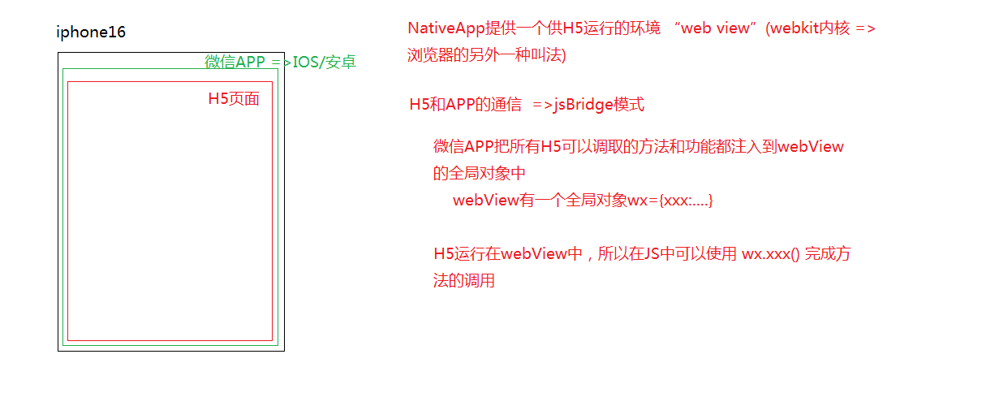

# Hybrid混合APP开发

1. 前端做的都是H5页面  WebApp
  ->运行在浏览器中
  ->移动端不仅可以运行在浏览器中，还可以运行在 APP 中（例如：微信、自己公司的APP中）

  [优点]
    及时更新（不需要用户选择，我们只需要把服务器上的源文件更新，用户访问的永远是最新的）
    跨平台

  [弊端]
    不是直接运行在操作系统中的吗，是运行在浏览器或者APP中的，所以不能直接的操作手机上的软硬件（运作模式：H5通知浏览器或者APP我们想做什么 -> 浏览器调取手机的软硬件 ->浏览器把信息返回给H5）
    性能没有APP好
    ...

2. APP不是H5，它是原生的应用 NativeApp
  ->IOS: object-c / swift  (需要C的功底)
  ->安卓：java-native   (需要JAVA功底)

 [优点]
   用户把安装包下载到手机上进行安装，后期程序是直接运行在手机操作系统中的
     A:性能高
     B:可以调取手机内置的软件或者硬件（例如：调取摄像头、重力感应器、通讯录等）[前提用户需要同意才可以]

 [弊端]
   不能跨平台，一款产品需要两个团队开发两套不同的安装包
     A:成本大
     B:版本不统一
   不能及时更新
   苹果商店上传一款APP需要7天审核周期

3. Hybrid混合开发模式
  把传统IOS和安卓开发与H5开发结合在一起来做（微信公众号开发：把我们做的H5运行在微信APP中）

  

4.ReactNative ionic 微信小程序 ...